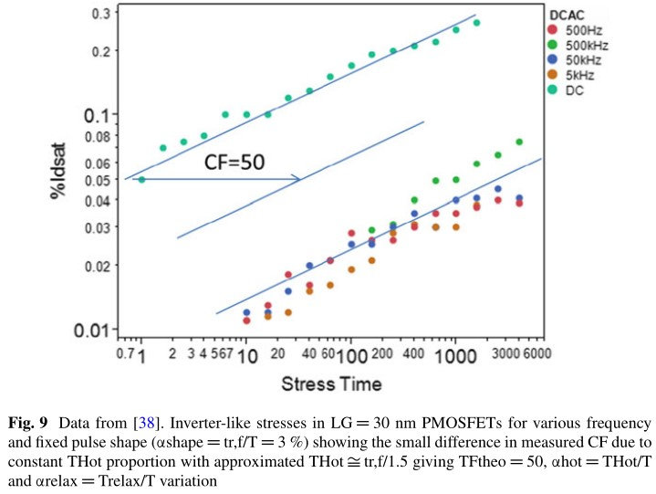

# From Atoms to Circuits: Theoretical and Empirical Modeling of Hot Carrier Degradation

标题：从原子到电路：热载流子的理论和经验模型

作者：William McMahon, Yoann Mamy-Randriamihaja, Balaji Vaidyanathan, Tanya Nigam, and Ninad Pimparkar

摘要：氘环境退火使得CMOS热载流子寿命延长，这触发了对热载流子退化的直接的物理描述。各种潜在的同位素效应为定性讨论提供了背景。在这一背景下，经典的工业DC热载流子应力模型和AC电路的模型得到了发展。

## 1 介绍

如何将对热载流子退化（HCD）的理解从原子层上升到电路的寿命？本书的不同章节将从不同角度尝试回答该问题。HCD理论十分复杂。尽管工业合格模型使用的是简单的 $\% I_{dsat}$ 和 $I_{sub}$ 表达式，或者偏置的表达式，但是一个完整的 HCD 模型在广泛的器件沟道长度、温度和偏置范围内都是准确的，它涉及非平衡载流子分布的量子热电化学相互作用，以及其他各种复杂性。完整的第一原理模型必然需要计算如下内容的软件：

1. 热载流子分布（包括能带结构、简化玻尔兹曼传输方程的测策略、泊松方程解法器、以及一些量子机理修正。）
2. 固体内的电子传输截面（根据作者所知，这种软件不存在）
3. 缺陷能量（使用密度函数理论或其他量子化学方法加上各种近似）
4. 分子动力学模拟（将局部激发传导到晶格）
5. 量子热传导

本书细致地讲述了第一原理模型所需的方方面面，以及不同团体是如何利用这种模型预测实际电路寿命。Bravaix, Huard 和 Tyaginov 的章节尝试从底层物理机理出发来提出预测模型。关于热载流子分布函数的性质和如何近似计算它将在 Rauch, Bina, Zaka 和 Tyaginov 的章节描述。如何使用热载流子分布函数来计算热载流子退化造成的损伤，将在 Rauch 和 Tyaginov 的章节讨论。激发概率的问题将在 Bravaix 的章节讨论。缺陷能量在 Aichinger 的章节讨论，并且在下一章，Pobegen 会讨论温度加速恢复。Huard, Scholten 和 Schlünder 的章节讨论如何缝合器件模型与电路模型的差异。在其他不同器件（LDMOS, FinFET, SiGe BJTs 和 SiGe Channel PFETs）中的热载流子损伤在 Reggiani, Alagi, Cho, Chakraborty 和 Franco 的章节中讨论。剩下的章节将讨论HCD的原子性描述，并从原子性描述引申到实际的电路预测。

对于可靠性工程师，上面的五个领域都需要近似处理，导致计算结果只适用于特定范围：这个限制使得适用于宽电压范围和多种器件尺寸的HCD模型是不实际的。但是这些作者发现对HCD物理的理解可以对工程中的可靠性技术提供指导。特别是，理论可以为模型的简化提供指导（或根据实际调整简化的模型）。在理解这点后，我们将本章分为三个部分。我们首先讨论物理学家和工程师在优化HCD技术难点时所关心的问题：在观察到HCD同位素效应的背景下，其电子化学反应的物理是什么？第二部分讨论的是可靠性工程师常用的DC模型，以及这些模型的理论修正。最后部分讨论如何用DC应力模型去预测AC寿命，最终从原子层上升到电路层。

## 2 氕、氘与热载流子退化理论的基础

氢气在钝化硅/氧化硅界面的缺陷的作用已经被人所知。最近，氢气在HCD中所起的作用被概括性地描述为：在半导体处理流程的最后，如果用氘气替换氢气，则会将热载流子寿命提高一个数量级。注意，优化氘的钝化作用并不简单，因为氮化硅层会对氢气和氘气的扩展起到阻挡作用，阻止氘气到达 Si/SiO2 界面。高压氘气环境可以促进氘气到达 Si/SiO2 界面。

同位素效应的证明由实验推动。使用扫描隧道显微镜发现，同位素效应与氕氘在界面处的分解率差异有关。该证明巩固了 HCD 对氢的归因，并在“HCD物理”与研究较为丰富的“STM诱导的表面原子分解物理”之间建立了桥梁。

### 2.1 电子诱导的键断裂与同位素效应

有一些简化能使得STM诱导的情况更接近于HCD的情况：第一，载流子的能量和数量分别都可控；第二，相比于Si/SiO2界面，硅表面吸收的氢更加均匀。这样，可以分别检验电子能量与电流对均匀分布的Si-H键的作用。其中，电子诱导分解过程中的挑战在于电子与离子的质量差异非常大，而电子与氢离子的质量差异是所有元素中最小的。由于这种质量差异，电子与离子间的能量传递很难发生，且直接传递的能量很少。所以电子诱导键断裂需要其他非直接的途径，对于CMOS中电子能量（只有几eV）更是如此。我们将在同位素效应的背景下讨论这些途径。

应当注意的是，氘和氕的质量比是所有同位素中最大的，同时，氕是所有元素中质量最接近与电子的。所以在电子-离子反应中，可以预见：氕更有可能移动，并且氕和氘的运动差异比其他同位素更大。

[图片1 氕/氘的同位素效应的量子化学。（a）成键/反键 PES 存在于 Born-Oppenheimer 近似。不带电离子的波函数的瞬间激发符合 Franck-Condon 近似。离子波函数的激发/转变由箭头指明。与对应箭头颜色一致的数字表示文中提到的同位素效应（b）H和D的质量差异提高了势垒隧穿的概率，隧穿所需能量减少了 $p\times E$，其中，$p$ 是电偶极子的动量，$E$ 是局部电场。]

### 2.2 Born-Oppenheimer近似和Franck-Condon近似、势能面与同位素效应

在理解HCD中的同位素效应（如图片1所示）时，需要用到两个近似。第一个近似在成键能量的量子化学计算时用到，称为 Born-Oppenheimer (B-O) 近似。在 B-O 近似中，离子的质量可以在计算键能量时忽略，使得计算键能量的 Schroedinger 方程中的波函数简化为：

$$
\Psi(R,r) = \psi(R)\phi(r;R)
$$

这里引入势能面（potential energy surface, PES）这一概念，其表示每个离子位置上的电子波函数能量，不包括动能，因此忽略了离子的质量。在这个近似中，键断裂的能量与同位素无关，即我们在计算量子化学键能量时不考虑同位素效应。

同位素效应通过另外两个近似引入。首先是我们通过把势能面当作简谐振子（SHO），从而得到键的振荡模式。这里重新将离子质量引入离子运动的量子态中。第二个近似称为 Franck-Condon 近似，它假设一个离子态激发到另一个离子态是瞬时的，对离子波函数没有影响，离子波函数随后沿着激发的 PES 演化。在这两种近似的背景下，有多种机制可以引起同位素效应。我们在氢和氘离子的背景下研究了这些机制，氢和氘离子钝化了硅表面的悬空键，因此可能的去钝化途径变得明显。大多数这些效应示意在图 1 中。

### 2.2.1 单电子激发的同位素效应

较重的物体与较轻的物体经过弹性碰撞后，速度与质量比有关。因此，单个电子在器件中只能获得几V的能量，不足以直接传递足够的能量使得具有几eV能量的键断裂。一个热电子只能激发价键电子的方式将能量非直接地传递给键。特别是，热电子可以传递足够的能量将价电子激发到反键态，进而导致反键态电子将能量传递给氢原子，使得键断裂。同位素效应 1 和 2 与这种键断裂有关。

同位素效应 1（单电子）：激发/反激发

从成键态激发到反键态的概率取决于两个势能面间的能量距离，该距离是简谐振子中两个离子之间相对距离的函数。因为氢的质量大约是氘的质量的一半，所以在所有 SHO 模式下，它比氘延伸的距离要远得多，因此具有更高的激发概率。

同位素效应 2（单电子）：沿着反键势能面的演化

一旦电子被激发到反键态，成键离子会沿着该能态加速，直到该电子回到成键态。该加速过程是质量的函数，所以会存在同位素效应。

### 2.2.2 多电子同位素效应

键具有多种振动模式，与势能面的 SHO 能级有关。当电子能量相对较低时，它们仍然可以激发这些 SHO 模式。如果电流足够大，就可以激发足够多的模式来破坏键。同位素效应 3-5 与这种键断裂模式有关。

同位素效应 3（多电子）SHO 的极子激发

SHO 阶梯上的激发可能涉及传入电子和 SHO 跃迁偶极子之间的偶极子相互作用。跃迁偶极子是原始状态和激发态之间平衡差的函数，而这些距离是离子质量的函数。

同位素效应 4（多电子）SHO 的共振激发

SHO 阶梯上的激发可能涉及与键共振耦合的电子，即暂时将该键电离到新的 PES。原子核将沿着新的 PES 演化，直到进入的电子离开临时轨道。与同位素效应 2 相似，这里存在与离子加速相关的同位素效应。

同位素效应 5（多电子）声子耦合

一旦局部硅氢前驱体的局部模式被激发后，它最终将失去能量到周围的晶格。硅-氢声子和硅-硅声子之间的耦合与声子模式之间的相对能量有关。由于“硅-氘拉伸和弯曲模式”与“硅-氢拉伸和弯曲模式”具有不同的能量，因此存在与这种耦合相关的同位素效应。有人认为，硅-氘弯曲模式和硅-硅横向光学声子模式之间更有效的耦合增强了硅-氘同位素效应。

同位素效应 6：氢和氘的不同扩散速率

氢和氘的不同质量会影响它们的相对扩散速率，并可能导致到达 Si/SiO2 界面钝化悬空键的效率不同。类似地，氢使硅悬挂键去钝化的尝试频率由 SHO 模式频率给出，因此即使在假定去钝化纯粹是电场诱导的（与同位素无关的）势垒高度降低的函数的热化学模型中，也可能存在同位素效应。

## 2.3 STM 诱导分解的定性分析

单电子STM诱导分解遵循如下一阶速率方程：

$$
\frac{d N}{d t} = \frac{(N-N_H)}{\tau}
$$

其中，$N$ 是断裂的键数量，$N_H$ 是前驱位置的数量。对于 $t\ll \tau$，速率与时间线性相关，从而分解率（以及与 $N$ 线性相关的HCD 退化速率）在 log-log 坐标图中是线性的，斜率为 1。在实际 HCD 情况下观察到的时间指数小于 1 的一些原因将在本章后面给出。多电子破坏键的广义方程具有如下形式：

$$
\frac{d N}{d t}=N\sum_{i=0}^{N_p} \tau_i^{-1} = N \sum_{i=0}^{N_p} [P_i R_{ei}]
$$

其中，$P_i$ 是在特定 SHO 能级 $i$ 的概率，$R_{ei}$  是该能级上的单一电子破坏键的概率。这可以另外表示为：

$$
\tau_i^{-1} = \sum_{i=0}^{N_p} \left[ \frac{\int f_d f_v + \frac{\exp(\frac{h\omega}{kT})}{\tau_p}}{\int I_d f_v + \frac{1}{\tau_p}} \right] \int I_d f_d
$$

其中，$I_d f_{v,d}$ 项是对电子能量与震动或单电子解离激发概率的积分，$f_d$ 是激发能级 $i$ 的函数，$\tau_p$ 是局部振动模式对晶格的弛豫速率。

在 HCD 的情况下，这个（已经很复杂的）速率方程仍然掩盖了具有栅极和漏极偏置的激发项的复杂性，但可以观察到几个定性的结果。在单载流子状态下，温度依赖性源于激发概率的温度依赖性（假设很小）和载流子密度的高能量尾部（假设随着温度升高而降低）。因此，长通道（单电子）HCD 机制的负活化能的起源就清楚了。当多个载流子参与键断裂时，温度依赖性反映了 SHO 能级的占据以及由此导致的键断裂势垒的降低。这显然不是 Arrhenius。

当在多电子状态下受压的器件没有电流流动时，键将从激发的 SHO 模式松弛回其基态，时间尺度与能量从单模式转移到周围晶格有关。直流应力中激发/反激发速率 (Idfv) 是一个近似于与时间相关的常数，交流应力则与直流应力相反，该速率将取决于漏电流流动的时间长度，即是电路通电时间的一小部分。

## 2.4 实际中的同位素效应：多晶硅栅对比High-k金属栅，平面对比FinFET

当占主导地位的 CMOS 技术涉及具有 SiO2 电介质和多晶栅的平面硅器件时，器件的阈值电压主要由器件中的杂质决定。在典型的合成气体退火温度 (350–450 ℃) 下，掺杂剂扩散或多或少不存在，因此阈值电压在这些温度下相当稳定。相比之下，金属栅极中的金属在该温度范围内可能更易挥发，因此在生产线后端的氢和氘退火之间的关系可能会因可能发生的阈值电压漂移而变得相当复杂，尤其是在没有被优化的金属叠层中。提供 high-k 金属栅极技术的重大挑战之一是堆栈的热稳定性，特别是在后端处理时各种金属层之间的退火期间阈值电压随沟道长度的滚降。因此，氢和氘在 high-k 金属栅技术中的作用更具争议性。

类似地，PBTI 中涉及在用作 high-k 电介质的 HfO2 中的电子捕获。显然，在 NMOS 器件中，可能出现在热载流子条件下，HfO2中的电子捕获增强的现象。这种电子捕获在 NMOS HCD 中的相对作用可能对此类器件的 HCD 产生相当大的影响。对于 FinFET 器件，PBTI 显著降低，并且引入了相对而言没有电子捕获的(100)晶面以外的表面。因此，FinFET 可能会回归到更传统的 HCD 模型。

# 3 典型工业模型

HCI 的工业模型有几种形式。比较旧的，如适用于长沟道器件的幸运电子模型通常有如下形式

$$
\% I_\text{dsat} = I_\text{sub}^m t^n
$$

退化程度假设（测量）在 $I_\text{sub}$ 峰值对应的 $V_g/V_d$ 比率处达到最大值，并且会取多个满足该比率的电压，用于计算寿命与 $I_\text{sub}$ 的关系，并外延到工作电压。这种方法的缺点是，spice 模型一般不会提供准确的 $I_\text{sub}$，并且该模型在 $I_\text{sub}$ 峰值外的情况下并没有校准，因此无法通过这种准静态的近似法去预测电路寿命。对于多重振荡的区域，我们可以采用一个依赖漏电流的模型。这种模型的缺点是以晶体管的电流为输入量而非电压（原文此处说反了）。这引导我们采用第三种方法，使用：

$$
\% I_\text{dsat} = f(V_g) g(V_d) t^n
$$

其中，$f$ 和 $g$ 分别是是栅、漏偏置的简单函数。该形式只取决于输入的变量。在饱和区，$I_d$ 是随 $V_d$ 缓慢变化，且与 $V_g$ 近似满足平方关系，所以该模型与依赖 $I_d$ 的模型的关系应该十分简单。

## 3.1 热载流子模型对栅、漏电压的依赖性

$f(V_g)$ 和 $g(V_g)$ 的函数形式虽然简单，但根据经验，对于退化最严重的晶体管来说一般是正确的，这些晶体管通常是在最高允许偏置下的最短沟道器件。这使得数值上易于计算且测试效率高。模型的特定特征可能被忽略，这些特征包括如下观察到的现象：小器件的热载流子退化的最坏情况在 $V_g=V_d$，但长沟道器件则在 $V_{g@I\text{submax}}$（即使 $I_{sub}$ 达到最大值的 $V_g$）；器件从长变短时，HCD 激活能的符号会改变；PBTI 和 NBTI 的贡献很难评估，需要减去它们，以避免在 QSA 模型中重复计算（下面会讨论）。一个额外的要求是在 $V_g$ 和 $V_d$ 为 0 时，热载流子退化也应平滑减为 0，这就对方程(1)中 $f(V_g)$ 和 $g(V_d)$ 的形式有限制。因为（正如下面所讨论的）寿命要求通常在数百万秒的数量级，所以施加接近乘积 Vmax 的直流应力并不困难，这样简化模型的不准确引起的误差对于最坏情况下的器件（即接近Vmax的电压和接近标称值的沟道长度）的退化是微小的。还应注意的是，鉴于典型深亚微米器件（见下文）的 HCI 退化的多变性，如果没有非常大的数据集，就不可能区分这些模型。生成如此大的数据集需要并联的应力，这将在电压依赖性中引入串联电阻失真。使用广泛的电压范围，特别是在高端，会引入下面讨论的饱和效应，这同样会扭曲电压依赖性。BTI对 high-k 器件也起到不可避免的作用。最终，在广泛的设备类型上参数化近似正确的函数形式通常优先于优化函数形式。

但是，$f$ 和 $g$ 的合理形式有一些必要的组成部分。 合理地近似 DC HCI 应力的所有形式的 $g$ 都是随 $V_d$ 的急剧增加的函数。$f$ 一般在 $V_g$ 下降至最大退化情况对应的 $V_g$ 以下后急剧下降。对于长沟到器件，$f$ 在 $I_{submax}$ 附近取最大值，但对于短沟道器件 $f$ 随 $V_g$ 单调增加。

## 3.2 HCD的时间依赖性与修正

HCD的时间依赖性是，对于典型应力条件（对于某个工艺，$V_{d,g}$ 在 1 和 1.5$\times V_{norm}$之间，应力时间在 1ms~1Ms 之间）、一定范围的沟道长度、工艺条件，近似是 0.1~10% $I_{dsat}$ 退化的幂函数，幂指数通常在 0.3~0.5 之间变化。HCD 中通常包含多种物理机制，它们可能会在各种应力或工艺条件下对时间依赖性产生影响，并且主要成分可能取决于这些条件。物理机制可以看作是对上面讨论的导致次线性时间指数的一阶速率方程的修改。可能导致此类指数变化（并且可能与 NBTI 相同但比例不同，NBTI 通常具有较低的时间指数）的物理机制是俘获/释放、氢的扩散和再钝化、前体活化能的分散（及其对 反应或扩散），以及陷阱对后续陷阱/陷阱生成影响的反馈。我们可以相对轻松地使用其中一个或多个组合来构造满足经验观察的速率方程，即退化近似于次线性指数在0.3-0.5的幂函数。从历史上看，已知无定形固体具有这样的时间依赖性，并且“拉伸指数”已被用来描述这种行为。根据作者的经验，至少可以观察到以下几点对时间依赖性有影响：

1. 温度（随着温度上升，时间指数下降）
2. 栅偏置（随着偏置增加，时间指数减少）这可以合理地解释为电化学势垒能量分布中斯塔克（Stark）位移的影响。
3. 氮化物（氮氧化物一般有更低的时间指数）
4. 栅边缘与漏的重叠，导致短时间间隔捕获

捕获/反捕获效应倾向于添加 log(t) 相关的和恢复相关的项。

时间幂律没能满足一个明显的事实，即 %Idsat 的典型定义为 (Idsat-Idsat0)/Idsat0 必须在 100% 时饱和。这通常以多种方式之一处理。第一种方法是忽略它，通过将测量的退化限制在离 100% 足够远的百分比变化，从而使饱和效应很小。另一种方法是建立速率方程并求解。第三种方法是添加具有便捷数学特性的临时饱和项。一种典型的（但不是唯一的）模型是：

$$
\% I_{dsat} \sim At^n/(B+A t^n)
$$

其中，$A$ 包含电压/温度依赖，而 $B$ 必须小于或等于 1，一般假设为 1，使得在 100% 时达到饱和。通常，鉴定目标接近 10%，因此没有详细考虑饱和影响，但探索电压加速达到更高偏置需要适当处理饱和。

## 3.3 HCD诱导的可变性

BTI可变性，以及它对SRAM的影响是一个经过充分研究的合理现象。对比下，HCD诱导的可变性的资料则更少。SRAM开关频率相对较低，因此可以预期的是，HCD对逻辑电路的影响比SRAM单元更大，除了病理性SRAM使用模型。相比于BTI可变性，HCD可变性应该在逻辑器件中描述。文献中有几项这样的研究。

在这些研究中，HCD诱导的可变性已经被发现依赖于应力电压：整体偏移水平足以捕捉可变性。Magnone 展示了在 45 和 65 nm 器件中收集的 HCD 可变性数据，它们遵循高斯分布。相似的数据 对于亚 32 nm 技术，类似的数据以对数正态比例显示。与 Vt 变异性相比，HCD 引起的应力显示（图 4）会导致更高的亚阈值斜率变异性（一个数量级）。在这项研究工作中，在$\Delta V_t = 50$mV 的失效标准下，相对于150%的$\Delta S$扩展，$\Delta V_t$扩展增加了15%。亚阈值斜率的这种失配尤其对模拟设备的工作是有害的。 

图片2 HCD诱导的 $\%I_{dsat}$ 概率。

图片3 HCD诱导的 $\% I_{dsat}/I_{dsat}$ 可变性取决于其中位数。

图片4 数据来自 [33]。（a）45nm工艺器件中，HCD导致 $V_t$ 失配的标准偏差与亚阈值斜率（b）Vt 的后应力标准偏差影响最小，但亚阈值斜率的标准偏差显着增加

## 3.4 DC模型的非理想因素

随着器件的缩放，HCD 可变性变得更糟的一个后果是，理想化的仅晶体管的 HCD 测量在实践中变得更加难以实现。实现理想化的 HCD 存在几个问题，这些问题会随着晶体管规模的扩大而变得更糟，尤其是串联电阻和可变性。串联电阻的影响是器件电流的函数，并且器件电流一直在按比例增加。对于低功耗应用，数百 μA/μm 仍然是标称偏置的典型值（尽管特定应用可能会过载进入 mA/μm 范围）。对于高性能 CMOS 应用，典型的器件性能在 Vmax 时可以超过 1 mA/μm。除了器件电流的缩放，晶体管的可变性与晶体管的 1/面积成比例。用于表征 HCD 的晶体管长度和应力/感测电压选择受到限制，因为 HCD 必须针对给定技术的最坏情况进行表征，而 HCD 通常在标称器件长度下最大。为了最大化晶体管面积，晶体管宽度应该至少是标称宽度的几倍，以最小化晶体管时间零可变性对可靠性模型的影响。这种情况通常会促使选择几个 um 的晶体管宽度。晶圆探针台和源测量单元（SMU）的成本鼓励对多个并联设备施加压力，这会迅速导致这些 um 宽的设备驱动高达几十 A 的电流。典型的晶圆级探针的串联电阻为 5–10 Ω，因此仅通过探针尖端的合成串联电阻降可能为几十mV。鉴于通常的应力电压间隔为 100–200 mV，探针尖端和器件触点之间的串联电阻不可忽略。

观察这对 HCD 模型的影响的一种方法是采用以下形式的 HCD 模型：

$$
\% I_d \sim V_g^m V_d^p
$$

这种形式有许多简便之处。首先，在 $V_g$ 或 $V_d$ 为 0 时，退化也归为 0. 第二，当 $V_g$ 和 $V_d$ 同时变化时，依然满足幂律关系，幂指数为 $m+p$. 应该指出的是，$V_g$ 与 $V_d$ 的相对影响是什么物理机制在特定感兴趣的设备中主导 HCD 的指标。如果 $p>m$，那么载流子能量占主导；如果 $m>p$，那么栅电场或载流子数量主导退化。第三，栅偏置与电场偏置的相对作用在公式中显而易见。第四，这种幂律依赖导致了相当保守的寿命估计。即使在这个简化的模型中，串联电阻的影响也会使问题复杂化，因为饱和时栅极偏置的影响比漏极偏置强得多，因此校正后的 Vd 将具有形式 $(V_d-I_d(V_g)\times R)$，以及当 $V_g$ 很高时，“真正的”$V_d$会在一个小范围内变化，人为地减小了高 $V_g$情况下的 $p$.

幂律形式可以证明栅极偏置是合理的，因为在多重振动状态中可以预期栅极偏置近似幂律，其中可以预期速率遵循漏极电流的幂律。对于深亚微米器件，$V_g$ 幂指数的典型值为 $5-10$。注意到 $I_d$ 在饱和状态下近似为 $V_g^2$，$I_d$ 指数等于 $m/2$，这意味着通常至少涉及几个电子。

通常，合乎情理地，我们预期热载流子模型准确地包含 $V_g$、$V_d$、温度、沟道长度、多个阈值电压。因此，可以合理地期望这些条件中至少有三个条件用来构建具有最低准确度的模型。统计显着性需要合理数量的设备（其中合理性由用于最小化时间零可变性的设备几何形状确定，但也最小化模型的串联电阻失真）。因此，通常需要引入一定程度的应力并行化，但在共享源极/漏极焊盘时应谨慎小心，以最大限度地减少串联电阻失真。

如果想要简化用于 HCD 的模型，那么可以预期感兴趣的领域在简化模型的选择中发挥作用。在实践中，作者没有发现 f 或 g 的简单函数形式在整个器件通道长度范围内占主导地位。

# 4 从DC应力到AC模型

## 4.1 准静态近似（QSA）

为了方便和效率，热载流子退化和偏置电压不稳定通常使用静态偏置（DC）在单个晶体管上表征。在实际中，CMOS电路工作在动态条件（AC），所以将静态下的退化转化为动态就需要一个假设，即：静态模型可以在电路动态切换期间的电压条件上进行积分，并且在特定静态应力偏置下看到的退化水平将与相同几何晶体管中相同瞬时偏置条件下的退化相同。这是电路可靠性环境中使用的准静态近似 (quasi-static approximation QSA) 的形式。如果采用上述 f, g 形式的 HCI 模型，那么准静态建模的过程是在 t 中线性化，使得

$$
\% I_{dsat}(t+dt)^{1/n} = \% I_{dsat}(t)^{1/n}+f(V_g)^{1/n}g(V_d)^{1/n}dt
$$

并在 SPICE 模型生成的几个振荡周期内对感兴趣的晶体管上的 Vg/Vd 进行时间积分。然后可以将每个周期的寿命外推到寿命的尽头。

## 4.2 静态（DC）应力到动态（AC）建模

CMOS 器件被设计为仅在转换器件有大量电流流过。HC应力条件只出现在栅漏偏置上升或下降期间。一个例子就是图 5a 中所示的反相器，其输入/输出信号（$V_\text{in}/V_\text{out})$ 等于 $V_g/V_d$

所有可能的 $V_g/V_d$ 应力条件将在脉冲过渡期间覆盖（$V_g<V_d$，$V_g=V_d$，$V_g>V_d$），但由于退化随偏置下降而急剧下降，通常最大退化在循环期间的最坏情况条件下急剧达到峰值。一个合理的近似值是在计算 DC 到 AC 因数时只取这个峰值

$$
\text{DC}-\text{AC correction factor} = CF = \frac{\text{DC_degradation_worst_case}}{\text{AC_degradation}}
$$

图5（a）反相器（b）反相器的输入/输出等于N/PMOS的$V_g/V_d$，显示了反相器在交流应力下的漏极电流变化是短沟道器件上 $V_g$、$V_d$ 的函数

曾经使用过一个简化的公式，该公式考虑了：

- 在最坏情况下的时间（$t_{wc}$）
- 转换时间（上升/下降时间 $t_{r，f}$）
- AC脉冲的周期（$T$）

$$
CF = \frac{t_{wc}}{t_{r,f}} \frac{T}{t_{r,f}}
$$

Quader 等展示了该 DC 到 AC 因数接近于 50（NMOS）或 120（PMOS）。因此，50 这个最坏情况下的 DC 到 AC 因数被微电子工业长期使用。采用该因数，10 年的 AC 使用寿命对应 0.2 年的 DC 使用寿命。

## 4.3 从HC应力条件中减去BTI

HCI的恢复暂未被充分研究，但一般认为小于BTI。然后在 QSA 电路建模方法中将退化分为两个部分：HCI 和 BTI。这些可以单独集成并单独添加到电路模型中以进行退化。然后可以使用相当简单的方法对 BTI 恢复进行建模，即为给定技术获取 S 曲线，并使用 AC 应力的占空比因子来衡量 BTI 退化。使用这种方法将重复计算 HCI 压力期间出现的 BTI 分量，因此在 HCI 退化期间减去 BTI 部分的方法是有用的。

众所周知，HCI 是沟道长度的强函数：对于给定的氧化物厚度，较短的沟道长度将使 HCI 的退化程度更大。因此，对不同 $L_{ch}$ 的核心器件进行 BTI$(V_d)$ 实验可以区分：

- 短沟道器件中混合了HCI和BTI的退化模式（图 6a）
- 长沟道器件中带 $V_d$ 的 BTI 变化（不对称 BTI），而 HCI 被忽略了（图 6b）

在高 $V_d$ 的情况下，一种是将“BTI”分量与垂直栅极场相关联，这将在整个沟道中不均匀，尤其是在源极侧更强（“不对称 BTI”）。这与 $V_d=0$ BTI（“对称 BTI”）形成对比。Federsiel 等人在 bulk 和 FDSOI HK-MG PMOS 器件上进行了相似的 $BTI(V_d)$ 实验，但实验器件均为短沟道器件（见图 6a），因此假设在 HCI 退化发挥作用之前看到的 BTI(Vd) 趋势将继续下降。Ma 等人在短沟道（0.1μm）和长沟道（0.3μm） SiON PMOS 上研究了 BTI$(V_d)$，清晰地证明了 BTI$(V_d)$ 的饱和性。为了分离 BTI 和 HCD 的贡献，作者假设了在长沟道中见到的 BTI$(V_d)$ 趋势在短沟道中依然成立。尽管这是一个常见的假设，我们很难证明其有效性，尤其是当晶体管缩放进入速度饱和区。该假设允许确定 BTI 校正因子（从对称 BTI 到非对称 BTI，在 Ma 的论文中约为 0.5）。可以使用公式简单地减去 BTI 分量：

$$
\text{HC}_\text{pure}=\text{HC}_\text{stress}(V_g=V_d)-\text{BTI}(V_g,V_d=0)\times \text{BTI}_\text{factor}
$$

虽然这两篇论文都集中在 PMOS 和 NBTI，但也必须关注 NMOS 和 PBTI，它们在最近的平面栅极后置 HK-MG 核心器件中扮演着更重要的角色。类似的 BTI$(V_d)$ 实验已经在沟道长度从 20nm 到 1um，采用 gate last techonology 的 N/PMOS 上进行（见图 3）。类似的趋势在 N/PMOS 上出现，即 HCI 分量随着沟道长度的增加而减少，直到达到纯 BTI$(V_d)$ 条件，仍然表明 BTI 对 HC 应力（$V_g=V_d$）比对称 BTI 低。

NMOS 上 BTI(Vd) 实验背后的物理机制建模往往比 PMOS 情况更复杂。虽然 PMOS NBTI 永久部分和 HCI 都在 Si/SiO2 界面上产生界面缺陷，但 PBTI 主要是在 HK 中产生电荷俘获/缺陷，这可能会被具有足够能量注入栅极的热载流子进一步增强（见图 4a）。如 Hsu 等人 [28]（见图 4b）和 [38]（图 8）所示，这种后来的效应转化为在最近的 HK MG 核心器件上产生更大比例的深氧化物电荷俘获/缺陷。 ）。

为了准确地对 NMOS 上 BTI(Vd) 建模，我们必须考虑：

- 局部垂直电场和界面电荷密度
- 局部载流子注入效率
- 空间场和局部载流子能量

这是一项相当乏味的任务，而简单的 BTI 因子测量可以很容易地隔离要建模的纯 HCI 组件。关于 BTI 因子的一个相当简单的观察是，如果假设整个沟道内的垂直场下降相当，则可以假设 PBTI 相对于 NBTI 更快的电压加速将导致 NFET 的 BTI 因子小于 PFET。随着 FINFET 的引入进一步缩小规模似乎已将 PBTI 的担忧降至最低。然而，FINFET 的引入给 HCI 带来了其他挑战，如下一部分将简要讨论。

## 4.4 验证QSA

一旦建立了 DC 应力模型，有几种方法可以确定 CF：

- 使用 spice 模拟和 DC Vg/Vd HCI 模型来捕获简单的反相器环形振荡器一个或几个周期的持续时间的退化。
- 通过在类似反相器的 [38] 或标准 AC [39] 条件下向栅极/漏极施加 AC 脉冲来测量 AC 退化。
- 测量一个或多个环形振荡器结构上的 AC 退化并估计最坏情况的 HCI 条件。

出现了针对特定技术的 QSA 有效性的两种潜在测试。第一个是简单地检查上面 2 的频率相关性，即如果存在频率相关性，则 QSA 无效。第二个涉及将 3 与 1 的结果进行比较（“close the loop”）。后一种测试比较困难，因为没有标准化的电路集作为建立 HCD 模型有效性的基准，也没有已建立的最坏情况但现实的设计电路来最大化 HCD 相对于 BTI。测量 HCD 的频率依赖性和验证 3 对 1 都需要非常仔细地考虑应力期间的任何过冲，以及可能不容易与热载流子退化分离的（可恢复的）BTI 组件。正如下面将要讨论的，可以合理地预期在接近典型设备传热的时间尺度上会发生违反 QSA 的情况。使用标准晶圆级测量技术，很难在没有显著 RC 延迟的情况下达到由这种时间尺度表示的频率。

## 4.5 超越 QSA：粗略和广泛的经验性建模

不管确定 CF 的方法是什么，可以预期 CF 将是交流脉冲形状（上升/下降时间或扇出、频率和占空比）的函数，并且必须针对最坏情况的电路设计场景来确定。Bravaix 等人 [38] 展示了如何对近期来自 HKMG 28 nm 节点的短沟道器件的 CF 进行简单修正，以修正历史 CF（CF=50）。首先要从用于各种实际电路的集成 spice 模型的 QSA 预测开始，以估计最坏情况的 CF ($\text{CF}_{wc}$)。然后可以根据对各种电路的模拟影响来校正 $\text{CF}_{wc}$，可以通过对脉冲形状的影响和在 HC 最坏情况下花费的时间来参数化。最后，可以添加一个经验参数来估计由于器件冷却引起的退化的松弛。给定电路的估计 CF 为：

$$
CF_{estimate}= \alpha_{shape}\alpha_{hot}\alpha_{relax}CF_{wc}
$$

根据给定技术的热载流子退化的相对影响，可以测试一系列电路以确定合适的 CF。

图 9 显示了与 CF 的实际测量值相比，历史 $\text{CF}=50$ 的悲观程度。这一差距说明需要仔细评估 CF，以便为给定的技术节点提供最大的可靠性能。

## 4.6 超越QSA：物理

也许准静态近似最奇怪的方面是它工作得非常好，尽管它应该违背了各种热载流子退化的物理机制。特别是，至少有几个物理模型可以对观察到的热载流子退化的时间依赖性（可能与 BTI 相同或相似）的亚线性做出贡献。这些模型包括：反应扩散 [1]、捕获、缺陷活化能分布 [40-42] 以及退化对后续退化的反馈。准静态模型要求在消除应力偏置时晶体管不会发生变化。原则上，扩散、恢复（去钝化界面态的重新钝化）和去陷阱都会导致违反 QSA。这些都可以归类为晶体管的“恢复”，这是 BTI 应力中众所周知的现象，也作为热载流子应力的一小部分存在。除了基于恢复的 QSA 违背之外，直流偏置期间晶体管的状态可能与交流偏置期间不同。

## 4.7 针对特定情况修改半经验模型：SOI/FINFET

### 4.7.1 自热与SOI

图10 比较了在 bulk 和 silicon-on-insulator（SOI）上的HCI，器件的几何尺寸相似，均采用 gate-last HKMG 工艺，都有相同的栅堆叠。有几个明显的不同，清晰明了地展现了自热对退化有影响。首先，时间斜率更小，其次总的退化程度更高。

明显违反 QSA 的条件包括 SOI 中的自热和 BTI（SOI 或 bulk）中的反捕获或恢复。在 BTI 恢复的情况下，可以通过使用 BTI 纯粹是占空比的函数并估计特定电路的相关占空比的关系添加恢复校正因子，使 QSA 结果接近实际。在 SOI 中自热的情况下，可以通过估计在 DC 应力期间引起的自热来校正 DC 应力，然后通过在 DC 应力期间使用自热校正温度按活化能缩放 HCI。

### 4.7.2 FinFETs

与平面 2D 器件相比，围绕栅极增加了热载流子降解氧化物的可能性（见图 11）。此外，FIN 侧壁的晶体取向在界面处（$\langle100\rangle$ 与 $\langle110\rangle$）有更多可用的缺陷前体（Si-H），这将影响 HC 电流驱动的缺陷产生。FINFET 的另一个可能问题是由于 FIN 相对于平面器件的热导率降低而导致的自热的可能贡献，这在 [29] 中已被证明可以忽略不计。

如 [29] 所示，由于与暴露于热电子的表面积增加，相关的陷阱产生概率增加，HCI 随着 fin 宽度变窄而增加。这使得 FINFET 掺杂的优化成为 3D 而不是 2D 问题（见图 11）。减少特定晶体管中热载流子效应的典型策略是增加沟道长度，但行业趋势是对器件沟道长度有更多限制，因此 FINFET 技术可能会限制设计人员缩小热载流子效应的能力。在更高电压的 I/O 设备的情况下，这可能需要仔细优化结[44]。

