$$
\begin{align*}
\newcommand{\dif}{\mathop{}\!\mathrm{d}}
\newcommand{\p}{\partial}
\end{align*}
$$

原论文：https://bilder.buecher.de/zusatz/41/41077/41077618_lese_1.pdf

# The Energy Driven Hot Carrier Model

标题：能量驱动的热载流子模型

作者：Stewart E. Rauch, Fernando Guarin

摘要：MOS 器件中的热载流子效应的“能量驱动模型”于 2005 年首次提出，以替代短沟道区（尤其是在 130 nm 节点或以下）中无处不在的幸运电子模型 (Lucky Electron Model, LEM) 。能量驱动模型代表了 MOSFET 热载流子行为的新范式，其中基本驱动力是可用能量，而不是 LEM 中的横向电场峰值。模型预测显示与实验碰撞电离结果一致。各种技术的热载流子降解实验结果支持热载流子损伤中几乎通用的载流子能量相关截面($S_{it}$) 的概念。

## 1 介绍

载流子（电子或空穴）可以从穿过 CMOS 器件漏区高电场区域的过程中获得大的动能。当平均载流子能量明显大于热平衡中与晶格相关的能量时，它们被称为“热载流子”，因为在历史上，载流子动能被假定为在有效温度高于晶格温度时近似热分布（“麦克斯韦分布”）。这种分布与局部电场处于稳态，其有效温度取决于该场。如果载流子获得足够的能量注入栅极氧化物，或造成界面损坏，它们将导致 MOSFET 器件的电气特性不稳定。因此损坏率取决于横向电场。这是流行的“幸运电子模型”的基本内容。然而，出现了一幅新图景，称为“能量驱动模型”。正如我们将看到的，现代尺寸的 MOSFET 高场区中的准弹道传输通常会引起相当浅的载流子能量分布函数，直到高场区中可用的总能量，但随后在该能量处急剧下降，和一个陡峭的尾巴在更高的能量。这种急剧的向下弯曲或“拐点”导致热载流子损坏率，这取决于总可用能量。从这个意义上说，能量驱动模型可以看作是当前 CMOS 技术中热载流子退化效应的一种“紧凑模型”。

## 2 幸运电子模型

C.M.Hu 等人的幸运电子模型 (LEM) 仍然是大多数行业标准热载体模型和预测方法的指导原则。应用于硅中的基本概念可以追溯到肖克利，最初是汤森在 1900 年代早期发展起来的气体放电理论。在气体放电中，自由电子被电场加速，直到它们与气体原子碰撞。相互作用可能使原子电离，产生两个自由电子，进而再被场加速。该过程导致气体“雪崩击穿”。这就是使用“碰撞电离”一词的原因。电子在碰撞前至少移动距离为 d 的概率为，

$$
P(d) = e^{-d/\lambda}
$$

其中，$\lambda$ 被称为“平均自由程”。假设电子在碰撞过程中失去全部动能。电子从强度为 $F$ 的电场中获得的能量为 $E=q\dif F$，则电场的能量分布为：

$$
f(E)=P(E)=e^{-E/q\lambda F}
$$

这就是幸运电子模型的基础。这个分布很像是与温度有关的能量分布，即“麦克斯韦”能量分布（每个自由度），其等效温度，$T_\text{EFF}$ 是

$$
T_\text{EFF}=\frac{q\lambda F}{k}
$$

这种与热平衡中能量分布的巧合相似是“热电子”和“热载流子”名称的历史原因。

> 注：电子实际上并不以热的方式运动，热运动是各向同性的，二幸运电子模型实际上假定纯粹的弹道运动，速度严格沿着场方向。

接下来，为了对碰撞电离率或热载流子损伤率建模，引入另一个简化假设，即这两者都表现出非常陡峭的能量阈值。也就是说，低于阈值的电子能量的速率为零，而高于阈值则基本恒定。

众所周知，电场在空间上不是恒定的，因此 $F$ 被 $F_m$（最大场）代替，因为这是速率应该达到峰值的地方。在这些假设下，衬底电流 Isub 与漏极电流的比值（大约为碰撞电离比）由下式给出：

$$
\frac{I_{sub}}{I_D} = A e^{-\phi_i/q\lambda F_m}
$$

其中，$\phi_i$ 是碰撞电离的阈值能量。

热载流子率，定义为热载流子寿命的倒数，再除以漏电流，为：

$$
\frac{1}{\tau I_D} = Be^{-\phi_{it}/q\lambda F_m}
$$

其中，$\phi_{it}$ 是热载流子损伤的阈值能量。

两种形式的热载流子加速因子可以从方程 (4) 和 (5)中推导出来。第一种是 $\tau$ 和 $I_{sub}$ 的关系：

$$
\frac{1}{\tau I_D} = C \left( \frac{I_{sub}}{I_D} \right)^{\phi_{it}/\phi_i}
$$

通过对比光子诱导发射率，推测$\phi_{it}$ 和 $\phi_i$ 的值应该分别是 3.7 和 1.3 eV，因此比率应该是 2.9。这个方程经常被用于将在高衬底电流的应力电压下获得的热载流子实验数据外推到实际使用时的最大电压 $V_\text{DD,MAX}$。由于峰值横向电场与漏极偏压到沟道夹断压降（$V_{DS}-V_{DSAT}$）成正比，其中 $V_{DSAT}$ 是沟道中“夹断”或“饱和”点的电位，下面的公式通常用于 碰撞电离率

$$
\frac{I_{sub}}{I_D}=A\exp-\left[ \frac{b}{V_{DS}-V_{DSAT}} \right], \text{or}\\
\frac{I_{sub}}{I_D}=A(V_{DS}-V_{DSAT})\exp-\left[\frac{b}{(V_{DS}-V_{DSAT})}\right]
$$

热载流子电压加速的第二种更粗略的形式是：

$$
\tau \approx D e^{-V_0/V_{DS}}
$$

这经常用于寿命外推。

## 3 实际载流子能量分布方程

### 3.1 均匀电场

即使是相对较大范围的均匀电场的情况，Shockley 的幸运电子模型（以及 Hu 的扩展）当然也是对所涉及的实际物理过程的极端简化，这受到了许多作者的批评。主要缺陷似乎可与类比于气体放电——“撞击”或散射事件将导致载流子失去所有动能。由于声子相互作用是主要的载流子散射物理机制，动量传递可能很大，但每次碰撞的载流子能量损失（或增益）受到光学声子能量（硅中为 ~63 meV）的限制。因此，高电场输运更像是“幸运漂移”或“幸运散射”。在这些条件下，硅中的载流子 EDF 已使用各种技术进行了模拟。模拟 EDF 的一般特征是向下弯曲。也就是说，不是 ln(f) 与能量的近似恒定斜率（如 Maxwellian），这些斜率正在下降（更负）。然而，Goldsman 等人指出，如果使用与能量相关的平均自由程（大约在 50 到 80 埃之间），幸运电子模型在这些条件下仍然可以产生相当准确的预测。

### 3.2 不均匀电场，短程度和受限势能降

MOSFET 中超过沟道饱和点的横向电场高度不均匀，近似为横向距离的指数函数：

$$
F\propto e^{y/l}
$$

l 是一个比例因子，通常约为“$L_\text{nom}$”（给定 MOSFET 器件设计的最小设计沟道长度）的 10%。高场区的长度（在沟道中的夹断或饱和点之后）是 l 的一些倍数，但即使对于四分之一微米的器件，也可能小于或大约等于 100 nm，这已经短到足以影响 EDF。此外，由于电源电压的缩小，可从现场获得的最大能量越来越受到限制。许多作者已经表明，在这些条件下，EDF 在接近最大可用能量的地方有一个明显的拐点。这大约是从漏极到通道“夹断”点（此处称为“$V_{EFF}$”）的电位。在这个拐点上方，有一个“热”尾部，这是由于载流子从电场中获得了几乎最大可能的能量，并且还从声子碰撞中吸收了净正热能。随着 CMOS 器件尺寸的缩小和电源电压的降低，对 EDF 有两个主要影响。首先，当 $E < qV_{EFF}$ 时，EDF 变得更小。其次，靠近 $E = qV_\text{EFF}$ 的拐点加强，并向下移动到重要的能量范围。这些 EDF 的一般特性（大约在 $L_\text{nom} = 100$ nm 技术节点）如图 1 中两个 VEFF 值所示。如果该位置在中性漏区内，那么冷漏载流子将有贡献，此处可以看到低于 0.2 eV。这些可以忽略不计（因为它们不会导致热载流子效应），并且 EDF 可以拟合理想化分布，该分布对于 $E < qV_\text{EFF}$ 是“类 LEM”，但被更高能量的热尾截断：

$$
f_I(E) \propto \exp(-\chi E/qV_\text{EFF}), E\leq qV_\text{EFF}\\
\propto e^{-\chi} \exp[(qV_\text{EFF}-E)/nkT], E>qV_\text{EFF}
$$

使用此 EDF 将简化后面的讨论。文献中 $\chi$ 的典型值取决于 $L_\text{norm}$：25nm 时 $\chi \sim 0$，50 nm 时 $\sim 1$，100 nm 时 $\sim 2$，250 nm 时 $\sim 4$。$\chi$ 的弱 $V_\text{EFF}$ 依赖性和 f 的归一化因子被忽略。

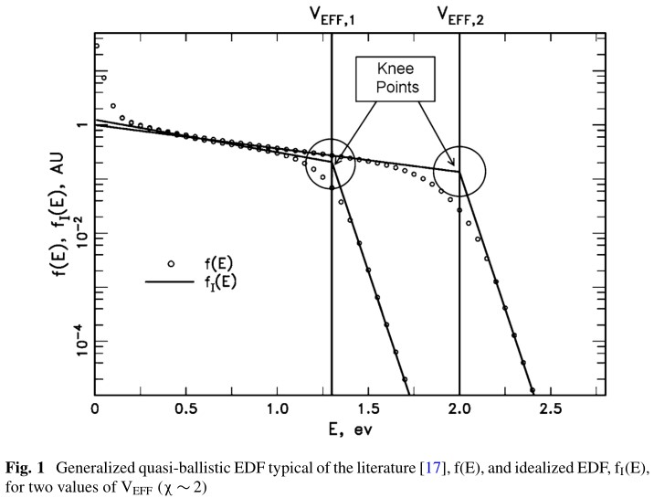

## 4 能量驱动模型

### 4.1 介绍

能量驱动模型的起点是热载流子速率的简化表达式，这是由于能量介导过程（例如碰撞电离或界面态生成）造成的。速率由以下形式的积分近似确定：

$$
Rate = \int f(E)S(E)\dif (E)
$$

其中，$f$ 是能量分布函数（EDF），$S=$反应截面或散射率。能态密度没有显式地包含在其中，可以考虑是 $f(E)$ 的一部分，或忽略。正如我们将看到的，这个速率方程的被积函数通常会在一个或多个点处达到峰值，这些点被称为“主导能量”，因为靠近这些能量的载流子主导着各自的热载流子速率。

这发生在，

$$
\frac{\dif \ln f}{\dif E}=-\frac{d \ln S}{\dif E}
$$

从数学上讲，主导能量受 $\ln(f)$ 或 $\ln(S)$ 的“拐点”（高曲率点）控制。幸运电子和能量驱动模型都是限制性假设，以允许热载流子诱导损伤效应的简单统一方程。虽然幸运电子模型隐含地假设 $\ln(S)$ 函数的拐点驱动主导能量，但能量驱动模型则是基于 $\ln(f)$ 的拐点驱动主导能量这一想法。

LEM 代表大型（长高场区）器件和高电压限制。然而，我们知道随着电源电压的降低，EDF 在热载流子效应的重要能量（通常小于 5 eV 左右）上变得越来越有限。在 LEM 中，EDF 没有明显的拐点，碰撞电离 (II) 和界面态生成 (ISG) 的主要能量由各自横截面中的拐点决定（在 LEM 中被认为非常接近能量阈值 $\phi_i$ 和 $\phi_{it}$）。图 2 是该碰撞电离概念的概念示意图。按照当时的思路，Keldysh 模型($\propto (E-E_G)^2$)[24]用于 $S_{ii}$。

II 和 ISG 的速率是场驱动的：（1）主导能量是偏置条件的弱函数；（2）热载流子偏置依赖性几乎完全归因于 EDF 斜率随场的变化。

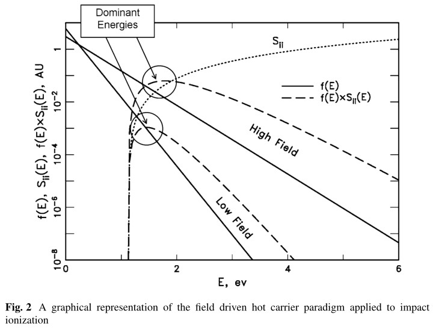

### 4.2 能量驱动的热载流子速率的条件

为了说明热载流子行为受能量驱动的条件，我们使用理想化的 EEDF，fI(E)，它将拐点折叠到一个点。记得前面说过，

$$
f_I(E) \propto \exp(-\chi E/qV_\text{EFF}), E\leq qV_\text{EFF}\\
\propto e^{-\chi} \exp[(qV_\text{EFF}-E)/nkT], E>qV_\text{EFF}
$$

使用以下形式的散射率：$S=A(E-E_\text{TH})^p$。在这种理想化的情况下，能量驱动机制可以定义为当主导能量 $=qV_\text{EFF}$ 时。使用方程 (12)，这可以简单表示为，

$$
E_\text{TH}+pnkT\leq qV_{EFF}\leq \frac{E_\text{TH}}{1-p/\chi},\quad \chi>p
$$

场驱动机制则是当 $V_\text{EFF}$ 高于该区域时。如果 $\chi < p$，则不存在场驱动机制。对于 $V_\text{EFF}$ 低于该区域，主导能量位于热尾部。这可能被称为“热尾驱动”机制。举一些近似数字为例，假设 $S=$ 电子碰撞电离速率（$S_{ii}$），$E_\text{TH}=E_G=1.12eV$，对于电子诱至碰撞电离 $p\sim 4.6$，另外 $n=1.66$，$T=300K$，

$$
1.317 eV \leq qV_{EFF}\leq \frac{1.12eV}{1-4.6}, \quad \chi>4.6
$$

既然对于 $L_\text{norm}<0.25mm$ 的 $\chi$ 典型值 $<4.6$，对于任何小于等于 1/4 微米的 NFET 器件，在任何 $V_\text{EFF}$ 下，碰撞电离都是能量驱动或热尾部驱动。ISG 的情况还有待观察，因为 SIT 是先验未知的。在这个图中，$S_{II}$ 使用的是 Kamakura 等人的更现代的模型 ($\propto (E-E_G$) [25]，它比旧的 II 模型“更软”（阈值附近曲率更小）。对于这些值，主导能量等于 $V_{EFF}$。

图 4 显示了 $V_\text{EFF}=1.2V$ 的热尾驱动情况。现在主导能量不再等于 $qV_\text{EFF}$，而是进入热尾。如果拐点决定了主导能量，那么 II 和 ISG 速率是“能量驱动的”：（1）主导能量跟踪偏置条件。 (2) 热载流子偏置依赖性主要是由于 S 函数的能量依赖性，通过 VEFF 的偏置依赖性。载流子 EDF 的场相关性（$\chi$ 的值）是次要的。

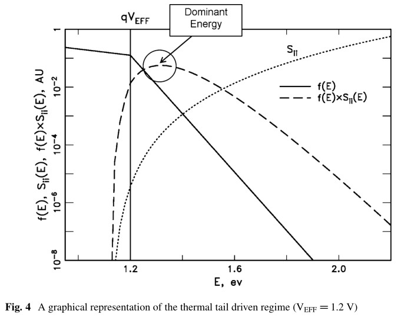

在能量驱动机制下，碰撞电离率大约与散射率成正比：

$$
r_{ii} \equiv \frac{I_{sub}}{I_D} = \int f_I(E) S_{ii}(E) \dif E \approx A_{ii} e^{-\chi} S_{ii} (qV_\text{EFF})
$$

$r_{ii}(V_\text{EFF})$ 的积分与 $S_{ii}(V_\text{EFF})$ 的对比在图 5. 可以看出，$r_{ii}$ 紧跟着 $S_{ii}$，直到下降到临界 $V_\text{EFF}$。小于该值时，$r_{ii}$ 遵循大约等于 $nT$ 的热斜率。

## 5 实验碰撞电离测量

我们使用 IBM 热载流子直流应力数据库中两种器件类型的实验碰撞电离结果来演示能量驱动的碰撞电离概念。（稍后将使用更多器件类型。）该数据库包括一系列通道长度，以及大量不同的 $V_{GS}$ 和 $V_{DS}$ 应力条件。

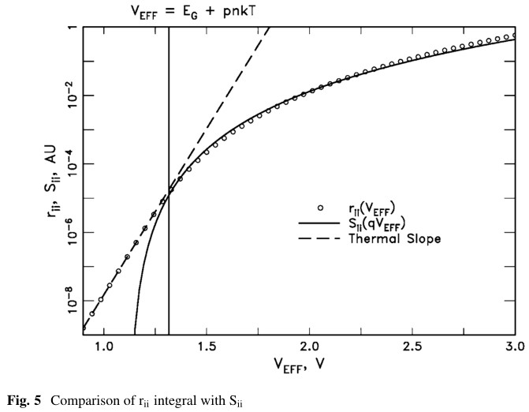

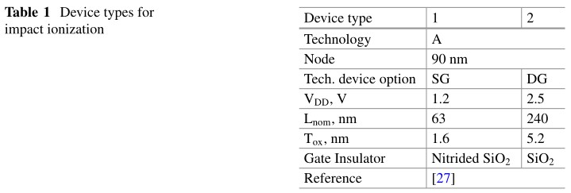

$V_\text{EFF}$ 的计算方法如下：

$V_\text{EFF}$ = 从沟道到漏的有效电势降：

$$
V_\text{EFF} = V_0 V_{DS} - V_{DSAT}
$$

其中，$V_0$ = 由 halo 和/或源方程引起的额外电势（预计总数约为数百毫伏），$V_{DSAT}$ = 夹断或饱和电压。此处采用来自 Taur 和 Ning 的 一个 $V_{DSAT}$ 方程：

$$
V_{DSAT}=\frac{2(V_{GS}-V_T)/m}{1+\sqrt{1+\frac{2(V_{GS}-V_T)}{mF_C(L-L_s)}}}
$$

其中，$F_C$ = 速度饱和临界场，$L=L_{POLY}$ 或 $L_\text{EFF}$，$L_S$ = 速度饱和区的长度，$m$ = 体效应系数。$V_T$ 的值是在 0 时刻测得的饱和 $V_T$（是 $V_{DS}$ 的弱函数）。$m$ 的值是由线性区的亚阈值斜率决定的（没有考虑 $V_{DS}$ 的依赖性），沟道长度依赖性则拟合为一个简单的模型：

$$
m(L)=1+m_0+\frac{l_m}{L-L_S}
$$

$L_S$ 是 $V_{DS}$ 的弱函数，但这被忽略了，在 NFET 中估计为 $0.4L_\text{nom}$，在 PFETs 中估计为 $0.3L_\text{nom}$。相关参数列在表 2 中。

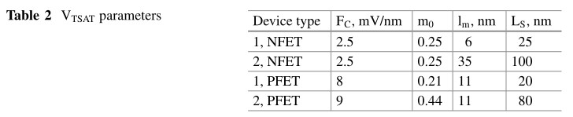

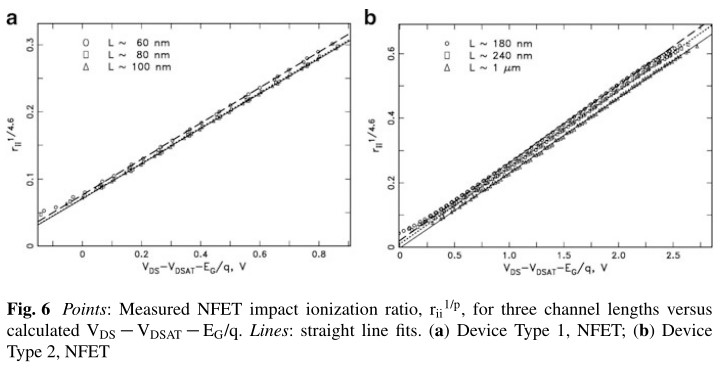

测量的体电流针对栅极和漏极泄漏电流进行校正。本节中所有测量的环境温度均为 303 K。由于缺少 $V_0$，数据被绘制为 $y=r_{ii}^{1/p}$ vs $x=V_{DS}-V_{DSAT}-E_G/q$，$V_{DS}$ 取一系列值，$V_{GS}$ 取 $V_T$ 附近的几个值。普遍接受的 $p=4.6$ 值用于 NFET。这应该会产生一条 x 轴截距为 $-V_0$ 的直线。由于图 5 所示的 $r_{ii}$ 积分和 $S_{ii}$ 之间的偏差，拟合值将与“实际”值不同。虽然它在概念上确实有一些物理基础，但我们将纯粹从经验的角度来处理 $V_0$。图 6 显示了器件类型 1 和 2 的 NFET 曲线。如图 5 所预测的，除了 x 值较小时外，线性度的期望得到了很好的满足。

对于 PFET，选择 $p=7$ 以产生合理的直线。这与文献中公布的值不一致，这些值通常要小得多，并且阈值能量大于带隙（$E_\text{TH} > E_G$）。比如，Kamakura 报告的值为 $p=3.4$，$E_\text{TH}=1.49ev$。PFET 中的碰撞电离可能比我们的简单模型具有更复杂的能量（和动量）依赖性。

器件类型 1 和 2 的 PFET 数据如图 7 所示。

表 3 列出了所有这些器件的直线拟合的斜率 (a) 和 x 截距 ($V_0$) 值。

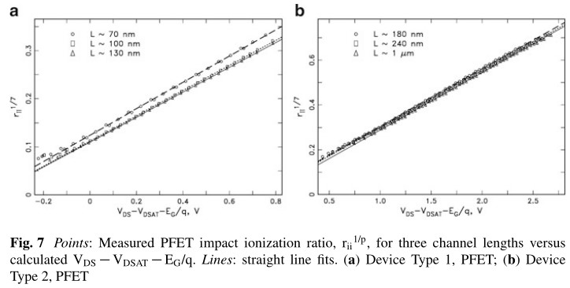

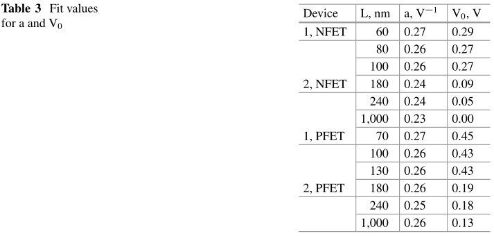

测量的 NFET 数据在 $\sim 1.4 V<V_\text{EFF}<\sim 3.7 V$ 时几乎完全符合方程(16)能量驱动的预测。尽管 $V_0$ 的值是经验值，但 $S_{ii}(E)$ 函数的预期斜率 ($p=4.6$) 和能量阈值 ($\sim E_G$) 可以很好地再现，与器件缩放无关，这一事实必须被视为对能量驱动模型的实验验证。这也为将这种方法扩展到通过实验确定 $S_{it}$ 函数提供了理由。同样，实验确定的 PFET II 参数（$p\leq 7$ 和 $E_\text{TH} \leq E_G$）在文献中不被普遍接受，这些参数不清楚。技术之间的水平非常恒定——这意味着参数 $\chi$ 几乎没有影响。

## 6 短程载流子-载流子散射效应

短程或库仑载流子-载流子散射是一种使载流子可以获得比 $qV_\text{EFF}$ 更大的能量的机制。两个高能载流子发生散射过程的可能性很小，而其中一个获得了总动能的大部分，导致载流子中一小部分电子获得最多约为两倍 $qV_\text{EFF}$。几位作者 [32-36] 将 Monte Carlo 或其他模拟技术应用于 nMOSFET，预测在漏电压低于约 3 V 时，电子散射 (e-e scattering, EES) “加热”的电子应主导电子的高能尾部能量分布函数（electron energy distribution function, EEDF）。因此，随着电源电压的降低，EES 事件可能在 nMOSFET 的 HC 退化中发挥着越来越重要的作用。载流子散射 (CCS) 在刚好小于 $2qV_\text{EFF}$ 时会导致第二个更弱的拐点（以及在略低于 $3qV_\text{EFF}$ 时甚至更弱的拐点，等等，这里将被忽略。）将 c-c 散射效应添加到基础 EDF 和理想化的 EDF 如图 8 所示。

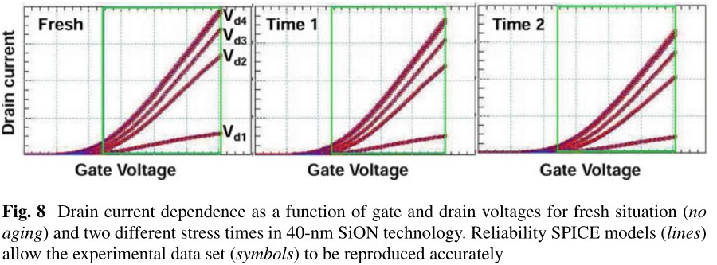

理想化的 EDF 是：

$$
f_I(E)=f_{I1}(E)+f_{I2}(E)
$$

$$
f_{I1}\propto \exp(-\chi_1 E/qV_\text{EFF}), \quad E\leq qV_\text{EFF}\\
\propto e^{-\chi_1}\exp[(qV_\text{EFF}-E)/nkT], \quad E>qV_\text{EFF}
$$

$$
f_{I2}=0, \quad E\leq qV_\text{EFF}\\
=a_{cc}V_\text{EFF}^{-3/2} \exp(-\chi_2 E/qV_\text{EFF}), \quad qV_\text{EFF} < E < 2qV_\text{EFF}\\
=a_{cc} e^{-2\chi_2} V_\text{EFF}^{-3/2} \exp[(2qV_\text{EFF}-E)/nkT], \quad E>2qV_\text{EFF}
$$

$V_\text{EFF}^{-3/2}$ 项是由于 c-c 散射截面的能量依赖性。由于每个载流子的 c-c 散射率大约与 $V_\text{EFF}$ 和 $2V_\text{EFF}$ 之间能量范围内的载流子密度成正比，因此 $f_{I2}$ 的相对水平 $a_{cc}$ 具有线性 ID 依赖性。对于这个例子，$V_\text{EFF}=1.76V$，$\chi_1=2.5$，$\chi_2=11.5$。$\chi_2$ 的值取决于 $\chi_1$ 和 c-c 散射截面的能量依赖性。此处将使用 $\chi_2$ 的近似表达式：

$$
\chi_2\approx 9 +\frac{\chi_1}{2}
$$

CCS 尾部的拐点对碰撞电离的相对影响可以通过以下方式确定。假设刚好低于 $2V_\text{EFF}$ 的尾部数量与 $V_\text{EFF}$ 处的基本种群之比的合理上限约为 $10^{-5}$，则尾部拐点处与基本拐点处的峰值 $f(E) \times S_{ii}(E)$ 比率是，

$$
\text{ratio} < 10^{-5} \frac{S_{ii}(2qV_\text{EFF})}{S_{ii}(qV_\text{EFF})}=10^{-5}\left(\frac{2qV_\text{EFF}-E_G}{qV_\text{EFF}-E_G}\right)^p
$$

对于电子（$p=4.6$），仅当 $V_\text{EFF}<1.23V$ 时，该比率将超过一，这是在热尾驱动范围内。似乎 EES 在合理的载流子浓度下太弱，无法在能量驱动区域（在尾部拐点处）贡献大量碰撞电离，尽管 EES 尾部的较低能量部分将在带隙或亚带隙 $V_\text{EFF}$ 附近（$<1.3 - 1.4 V$）。即使对于空穴（$p=7$），比率为 1 时出现在 $V_\text{EFF}=1.47$V，仅高于空穴的临界点（$1.42$V）。这将表现为一种热尾贡献的 CCS 诱导增强，并且不能通过能量驱动的近似值正确建模。

然而，对于 NFET，热载流子损伤率在大部分 $V_{GS}$ 范围内（对于给定能量）[3,37,38] 的 $I_D$ 是二次方的，这意味着 EES 尾部的拐点确实驱动了该速率。在这种情况下，热载流子损伤率可以写为能量驱动的近似值，

$$
R_{ISG}(V_\text{EFF})\approx A_1 I_D S_{it} (qV_\text{EFF})+A_2 I_D^2 S_{it} (qm_{EE} V_\text{EFF})
$$

$S_{it}$ 是界面态生成 (interface state generation, ISG) 散射率，参数 $m_{EE}$ 表示由 CCS 尾部引起的主要能量（对于 ISG）与由基本分布引起的能量之比。由于 CCS 拐点相对较弱，这可能往往小于 2。模拟表明 $1.7 - 1.95$（取决于技术）的值是合理的。$A_1$ 和 $A_2$ 是要为每种技术通过实验确定的常数——再次忽略任何弱 VEFF 依赖性。

## 7 实验性热载体降解测量

IBM 热载流子数据库横截面的热载流子结果由七种设备类型（包括已经介绍的两种）组成，说明了能量驱动的热载流子模型与数据比较。表 4 总结了这七种设备类型的特性。（重复了类型 1 和类型 2。）

虽然 I-V 特性中 ISG 的最佳度量似乎是 $\Delta (1/g_\text{mlin,max})$ [37, 43]，但已证明参数 $\Delta (1/I_\text{ON})$ (where $I_{ON}=I_D$ @ $V_{GS}= V_{DS}$=technology power supply voltage $V_{DD}$)在数据库中整个应力范围和沟道长度范围内更加稳健。然而，这种损坏指标显示了额外的通道长度 (L) 和阈值电压 (VT) 相关性。通过使用如下 $R_{ISG}$ 定义（“ISG 率”）将这些归一化：

$$
R_{ISG}\equiv \frac{1}{\text{Time to 5% change of}\left\{ \Delta(I_{ON}^{-1})(\frac{L}{L_{nom}})^b(V_{DD}-V_T) \right\}^{-1}}
$$

$b \sim 1-1.5$. 所使用的 $V_T$ 是在 0 时刻（应力前）的饱和 $V_T$

本节中的所有数据在 $T=303 K$ 下测得。

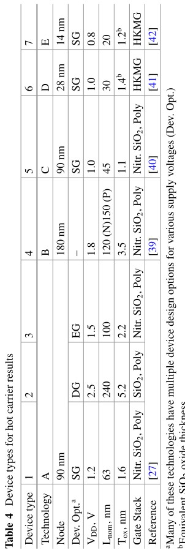

### 7.1 NFET 热载流子数据

NFET 的热载流子数据通常显示三种电流状态，例如我们之前报道的 [37, 38] 和其他人 [3]。这些机制在图 9 中以器件类型 4、NFET 为例进行了说明。当通过将 ISG 损坏率除以 VEFFp（p D 25，凭经验确定）近似归一化能量依赖性时，可以观察到电流依赖性。Ⅰ 和 Ⅱ 是线性和二次区域。Ⅲ 是“高 VG 区域”或“高电流区域”。在 Ⅲ 区域的损伤率增加的物理原因尚不确定，但文献中已将这种影响归因于各种原因：

1. H键断裂的氧化物场依赖性
2. e-e 散射增加，电位最小值转移到 SiO2 界面
3. 在高 $I_D$ 下,多振荡激发效应变得重要。有关多振动激励的深入讨论，请参阅“评估热载流子退化的球谐扩展方法”一章
4. 漏区局部自热

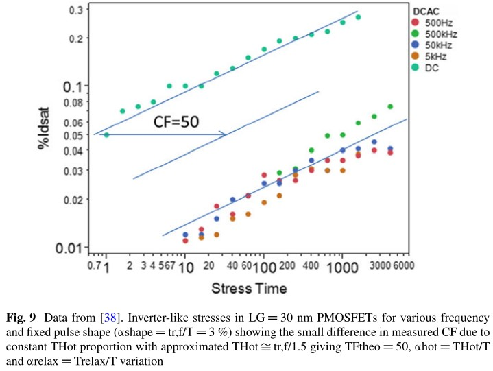

据观察，线性机制仅在低漏电流时占主导地位，通常在 $I_D < 10^{-4}$ 至 $10^{-5}$ A/um。这对该机制有几个影响。由于低 $I_D$，热载流子损坏率低。$V_{GS}$ 接近或低于 $V_T$，因此 $V_{DSAT}$很小，$V_\text{EFF}$  对 $L$ 的依赖性很小。此外，$I_D$ 是 $V_{GS}$ 的强函数。由于这些因素，我们的数据库中区域 Ⅰ 的压力比区域 Ⅱ 的压力要小得多，并且当与 VEFF 作图时，区域 Ⅰ 的数据往往是“稀疏的”。事实上，线性区域导致相对较弱的热载流子退化，在典型的 CMOS 开关瞬变期间，通常可以忽略热载流子位移。然而，区域 Ⅰ 是“非导通”模式 ($V_{GS} = 0$) 的关键，这会影响处于静态关断状态的短沟道 NFET。无论如何，区域 Ⅰ 数据对于扩展观察到的 $S_{it}(E)$ 的实验能量下限很有用，这将在后面看到。

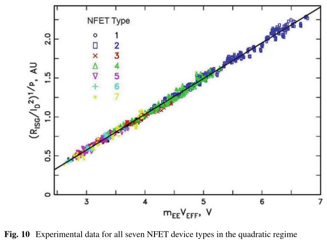

本节仅考虑来自前两种区域的数据，对应于等式 (23)。由于可用数据量较大，我们首先考虑二次项。图 10 中展示了对于所有器件类型，各种 $L,V_{GS}, V_{DS}$ 值的 NFET 数据（（绘制为 $y=(R_{ISG}/I_D^2)^{1/p$ vs. $m_{EE}V_\text{EFF}$）。该图中包含近 1000 个器件应力。通过模拟得到 $m_{EE}=1.7 - 1.95$ （取决于技术）。针对每种设备类型调整了各个级别，以使数据“对齐”。调整后的数据遵循为 $p=13.5$ 显示的直线拟合。这条线的 x 截距为 1.75 V。因此，这些数据意味着 $S_{it}(E)$ 函数可以表示为，

$$
S_{it} \propto (E-\phi_{it})^p
$$

$\phi_{it}$ 取 $1.75\pm 0.3 eV$，$p=13.5\pm 2$. 这些值根据经验基于 Sit 的假定形式，并且在 $\phi_{it}$ 和 $p$ 之间的拟合中存在折衷。1.75 eV 的 ISG 能量阈值与多位作者报告的 Si-H2 键在 Si-SiO2 界面的最小离解能值一致。这种形式和这些值与文献中的值相当：$\phi_{IT}=1.6eV$，$p=14$[1]，和 $\phi_{IT}=1.5eV$，$p=11$[3]

该图证明了二次（中等 $V_G$）状态下 NFET 能量驱动模型的“通用”性质，其最小主导能量为 $\sim 2.6 eV$ ($VEFF \sim 1.3 V$)。这很重要，因为在 CMOS 开关环境中，对于轻载和中载电路，中等 $V_G$ 状态，而不是状态 Ⅲ，通常主导热载流子退化。

接下来，显示了线性区域中的 NFET 数据。图 11 展示了对于所有器件类型的此状态下的 NFET 数据（绘制为 $y = (R_{ISG}/I_D)^{1/p}$ 与 $V_\text{EFF}$），同样取 $p = 13.5$。$VEFF > 2.5 V$ 的数据遵循 x 截距为 1.75 V 的直线。然而，在这个电位之下，它偏离了这条线，这意味着 $S_{it}$ 函数有一个低能量的“尾部”。

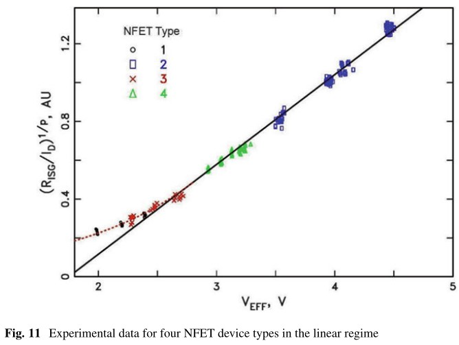

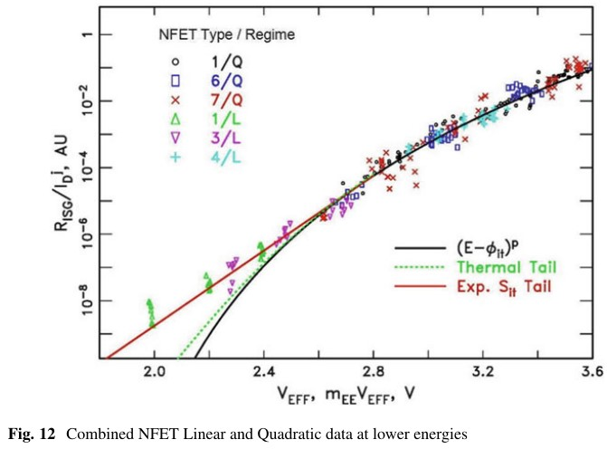

在图 12 中更仔细地检查了较低的能量范围。在这里，主要能量低于 3.6 eV 的线性和二次数据被组合在一起（$j=1$ 表示线性，2 表示二次状态），绘制在对数 y 轴上。x 轴对于线性数据是 $V_\text{EFF}$，对于二次数据是 $m_{EE}V_\text{EFF}$。实线是方程 (25)。EEDF 热尾对线性状态的计算贡献是绿色虚线。这种热贡献太小，无法解释这种差异。文献中报道了几种可能导致观察到的尾部的机制：(1) 具有较低阈值能量的较弱 ISG 替代通路 [48-50]；(2) SiO2无序引起的键能色散。由于尾部是在低 $I_D$ 下观察到的，因此预计不会产生多重振动激发效应：

$$
\begin{aligned}
S_{it} &\propto \exp(a E), E\leq \phi_{it}+p/a\\
&\propto (E-\phi_{it})^p, E>\phi_{it}+p/a
\end{aligned}
$$

具有以下参数值：$\phi_{it}=1.75 eV$，$p=13.5$，$a=13 eV^{-1}$

### 7.2 PFET 热载流子数据

## 8 为ISG损伤率修改能量驱动模型

需要回答三个关于ISG损坏率的问题：

（1）在二次方区中，损伤率会受到能量驱动吗？

现在我们有一个临时的 ISG 散射率，$S_{it}$，我们可以重新审视 4.2 节的 ISG。回想能量驱动的主导能量的上限：

$$
q V_\text{EFF} \leq \frac{E_\text{TH}}{1-p/\chi}
$$

现在，对于我们的实验性 $S_{it}$ 函数，$E_\text{TH}=1.75$eV，$p\sim 13.5$。这意味着典型的四分之一微米 ($\chi_2 \sim 11$) 或更低的器件，将受到能量限制。对于更大 $L_\text{nom}$ 的技术（例如，4V_{DD} = 3.3$ V 或更高），ISG 速率在足够高的电压下是场驱动。

（2）二次区域支配的条件是什么？

载波-载波散射尾部对 ISG 的相对影响可以通过以下方式粗略估计。在图 14 中，绘制了 $S_{it}(2V_\text{EFF})/S_{it}(V_\text{EFF})$ 与 $V_\text{EFF}$ 的比值。由于实验测量值不低于 2 V，所以曲线的那部分是虚线。能量驱动模型预测，CCS 驱动的热载流子引起的 ISG 随着电源电压缩小到 $V_\text{EFF} \sim 1.8 V$ 而变得更强。当然，由于载流子浓度的增加，器件尺寸缩放使得 CCS 增加。然而，从低于 1.7 V 开始，CCS 效应可能会明显减弱。尽管这是推测性的，但存在潜在的危险，即外推测量的二次状态 (中等$V_G$) 应力数据以使用低于 $V_\text{EFF} = 1 V$（$VDD \leq 0.8 V$ 左右）的条件可能会严重低估对热载流子的场暴露，这将是受线性区支配。

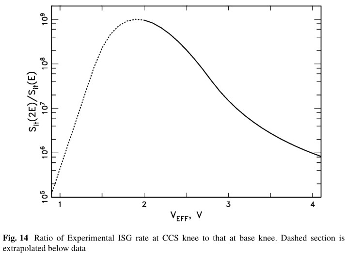

（3）二次区的近似（等式（23））有多好？

根据方程 (23) 如果 CCS 尾部在热载流子损伤中占主导地位，

$$
\frac{R_{ISG}(V_\text{EFF})}{I_D^2} = \int f(E) S_{it}(E) \dif E \approx A_2 S_{it} (qm_{EE}V_\text{EFF})
$$

将理想化 EDF CCS 尾部的数值积分 $f_{I2}$ 与图 15 中的 Sit($2qV_\text{EFF}$) 进行比较。相符得非常合理。由于仅使用峰值被积函数来近似积分，并且忽略了方程 (23) 中 $f_{I2}$ 的弱 $V_\text{EFF}$ 依赖性，因此存在部分补偿误差。鉴于此处介绍的能量驱动模型的简化和理想化（并且有点经验性）性质，实验 $S_{it}(E)$ 函数将与任何“实际”横截面略有不同。

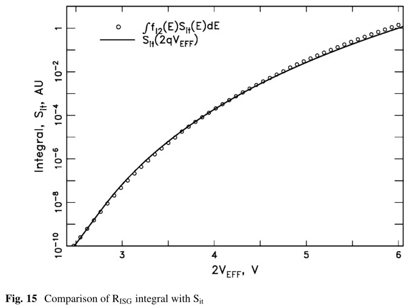

## 9 温度依赖性

通过引入其所有参数的正确温度相关性，可以扩展能量驱动模型以涵盖温度相关性。传统上，对热载体的主要温度影响归因于 $\chi$ ——平均自由程随温度的变化。普遍接受的表达是由 Crowell 和 Sze 在 1966 年引入的

$$
\lambda(T) = \lambda_0 \tanh (E_R/2kT)
$$

其中，$E_R=63meV$ 是硅中的光声子能量。室温附近 $\lambda$ 是一个相当微弱的温度递减函数；它在 $T = 400 K$ 时的值是其在 300 K 时的值的 0.86. 然而，在幸运电子模型中，它以指数形式出现，因此净效应随着温度的升高而急剧降低热载流子速率。这种效应体现在能量驱动模型中，由基本分布的参数 $\chi$（或 $\chi_1$）体现，概念上 $\propto 1/\chi$。通过方程 (16)、(20a) 和 (21)，碰撞电离率和ISG率在线性和二次区域下都将具有相同的 $\chi$ 相关性，$e^{\chi_1}$。假设 $\chi_1\propto 1/\lambda$，并使用等式（29），这项的温度依赖性在 200 到 400K 的范围内可以近似为 $T^{-nt}$，其中 $nt=0.4\chi_1$（300K）。因此，随着缩放，平均自由程温度依赖性的影响下降，在 $L_{nom} = 50 nm$ 技术或以下变得非常小，并且可能随着标称沟道长度下降到 $25 nm$ 或以下而完全消失。其他参数将驱动整体热载流子速率温度依赖性。

首先我们考虑碰撞电离。等式(16) 的温度依赖性是，

$$
r_{ii}(T) \approx A' (T)e^{-\chi(T)}[qV_\text{EFF}(T)-E_G(T)]^{4.6}
$$

我们写作 $A'(T)$ 是因为方程（16）中的积分引入了 $T^{0-1}$ 的正温度依赖性（被积函数的有效宽度随 $T$ 增加）我们已经讨论了 $\chi$ 的依赖关系。这两个相互竞争的项组合在一起形成一个经验性的与温度相关的前置因子：

$$
A'(T) e^{\chi(T)}\approx A^n T^{nt}
$$

对于 $E_G(T)$，我们使用 Sze 的

$$
E_G(T) = 1.17 eV - \frac{0.000473eV/K\cdot T^2}{636+T}
$$

展开 $V_\text{EFF}(T)$

$$
V_\text{EFF} (T) = V_0(T)+V_{DS}-V_{DSAT}(T)
$$

$V_{DSAT}(T)$ 依赖性主要是由于 $F_C$ 和 $V_T$ 的依赖性。 （忽略了 m 的小温度依赖性。）

$$
F_C(T)=\frac{v_{sat}(T)}{\mu_{eff}(T)}
$$

对于 NFET，我们可以将该式近似为 $\propto T$。$V_T$ 直接通过对应力设备的测量来确定。$V_0(T)$ 预期应为 $\propto T$，但是，我们采用经验方法。例如，在图 16 中，针对器件 1、NFET、$L= 65 nm$ 和 $T = 233、303、398 K$，绘制了 $r_{ii}^{1/4.6}$ 与 $V_{DS} -V_{DSAT} -E_G/q$ 的关系图。对于 $T= 233、303、398 K$，这些拟合的经验 $V_0$ 值为 0.220、0.285 和 0.377 V。在这种情况下，$V_0$ 几乎与 T 成正比，斜率不随温度变化，但并非所有测量的器件都是如此。（$nt=0$）为拟合实验数据而开发的模型是， 

$$
V_0(T) = V_0(L,T=300K)+TC_V\cdot (T-300)
$$

使用该模型，可以使特定设备类型在各种温度和沟道长度下的低过载下的碰撞电离数据拟合在一条曲线上。图 17 显示了器件类型 1 和 2 的温度数据，它们被选为缩放效应的示例。

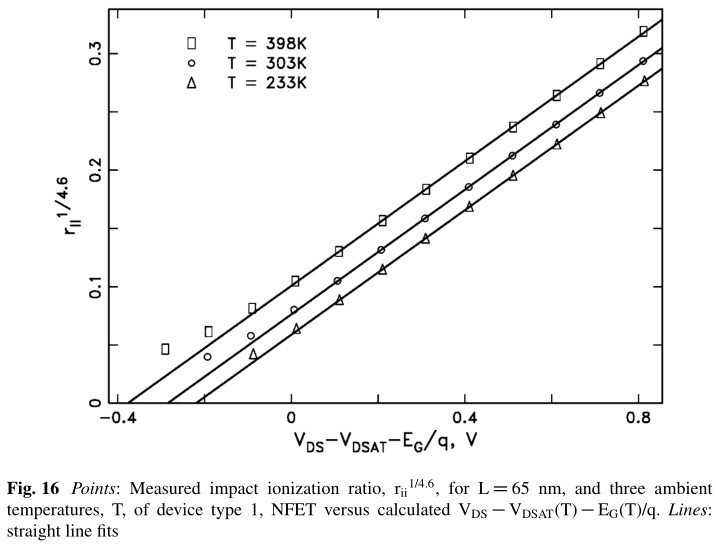

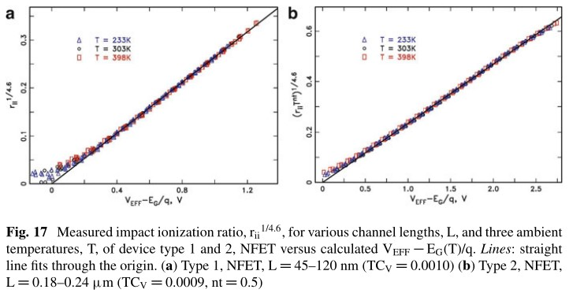

在典型的中等 $V_g$ 应力偏置条件下，热载流子引起的电流偏移，但对于这些相同的器件类型，三个温度显示在图 18 中，以及具有与碰撞电离相同参数的模型预测。

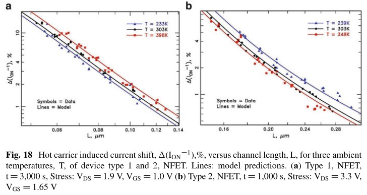

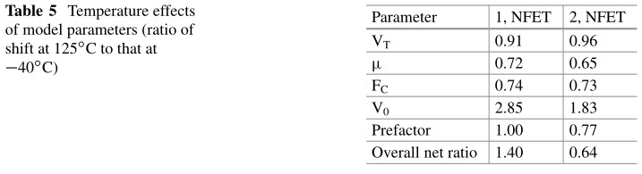

观察到的温度依赖性与模型很好地匹配。请注意，这两种设备类型具有相反的温度依赖性——1/4 微米 NFET 表现出负温度系数的经典行为，而 63 纳米 NFET 的热载流子偏移随温度增加。 我们通过计算这五个参数（$V_T$、$\mu$、$F_C$、$V_0$ 和前因数）的温度依赖性对偏移的影响来进一步探索这一点。表 5 给出了在 398 K (125°C) 和 233 K (40°C) 时由这些参数中的每一个（所有其他参数都固定在它们的 30°C 值）在 $L = L_{nom}$ 下的比率 $\Delta (I_\text{ON})^{-1}$。

缩放效果主要是由于这些参数中的两个——$V_0$ 和前因数。随着技术规模的缩小，电源电压的降低和 $V_0$ 可能的增加（由于更强的光晕）显着增加了适度可用能量随温度增加的积极影响。此外，随着通道长度的减少，平均自由程的负面温度影响（如前因数所反映的）也会减弱。

## 10 总结和讨论

通过在 $V_{DD}$ = 1.2 和 2.5 V 级器件中的实验测量，对 NFET 和 PFET 中的碰撞电离过程演示了能量驱动模型。NFET 碰撞电离遵循公认的能量依赖性 ($p = 4.6$) 和能量阈值 ($E_{TH} = E_G$)。PFET 碰撞电离的实验参数为 $p \sim 7$ 和 $E_{TH} = E_G$。这些参数在目前的文献中不清楚。

能量驱动模型在经验拟合各种技术节点上的实验 NFET 热载流子退化数据方面非常成功。如图 10、11 和 12 所示，该模型允许对从四分之一微米到 14 纳米技术节点的 NFET 器件的热载流子行为进行几乎通用的描述。PFET 热载流子退化结果也与该模型一致。技术节点之间不需要调整电压依赖斜率或加速度函数（如在幸运电子模型中），因为这基本上由 $S_{it}$ 函数固定。为每个节点通过实验确定的主要参数只是水平 [等式 (23) 中的 A1 和 A2]。当模型参数针对温度进行适当调整时，也可以正确预测热载流子降解的净温度依赖性。

实验性的 Sit 函数非常“软”——也就是说，它没有尖锐的“拐点”。当然，观察到的能量依赖性被 f(E)Sit(E) 乘积的能量宽度、f(E) 的空间变化以及可能部分占据高于基态的多个振动状态“抹掉”， 这将降低产生界面态的孤立大能量相互作用所需的能量。当然，观察到的能量依赖性被 $f(E)S_{it}(E)$ 乘积的能量宽度、f(E) 的空间变化以及可能部分占据高于基态的多个振动状态“抹掉”，这将降低产生界面态的孤立大能量相互作用所需的能量。高于 2.5 eV 的数据确实表明能量阈值为 ~1.75 eV。然而，低于 2.5 eV，$S_{it}$ 高于单一能量阈值模型的预期。这种偏差的可能解释是：（1）由于 SiO2 无序导致的 H 键能量色散；（2）H 解吸的多种途径。然而，没有看到与第二个较低的能量阈值相关的结构。将数据扩展到更低的能量可能会阐明这个问题。由于缺陷产生的复杂性，这些效应会导致非常复杂的，可能是“软”横截面。在这张图片中，此处提出的 SIT 函数必须被视为氢解吸的有效 ISG 横截面。