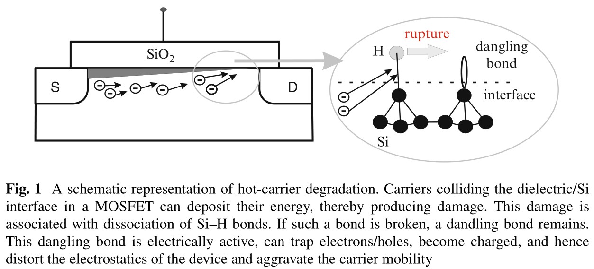
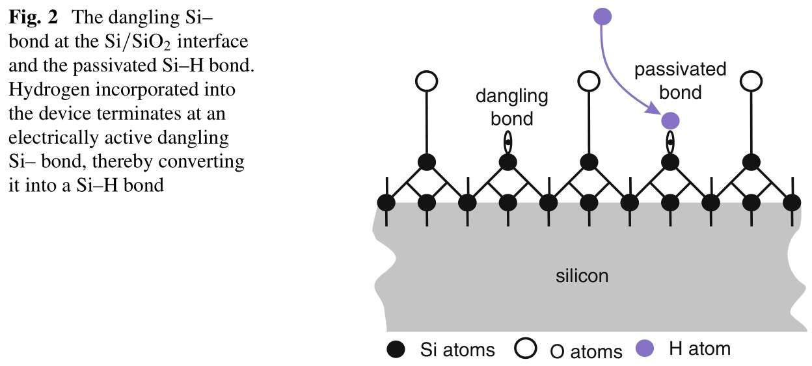
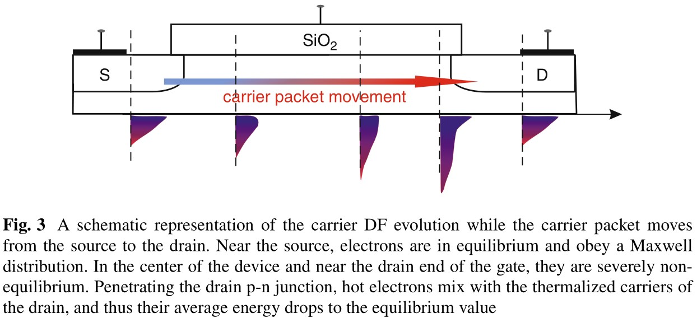
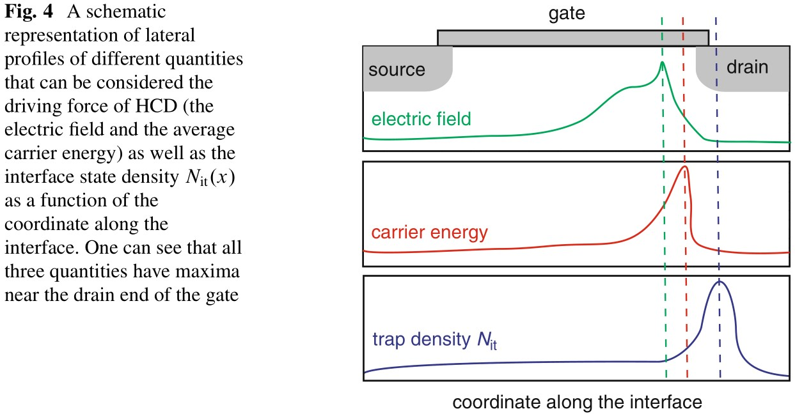
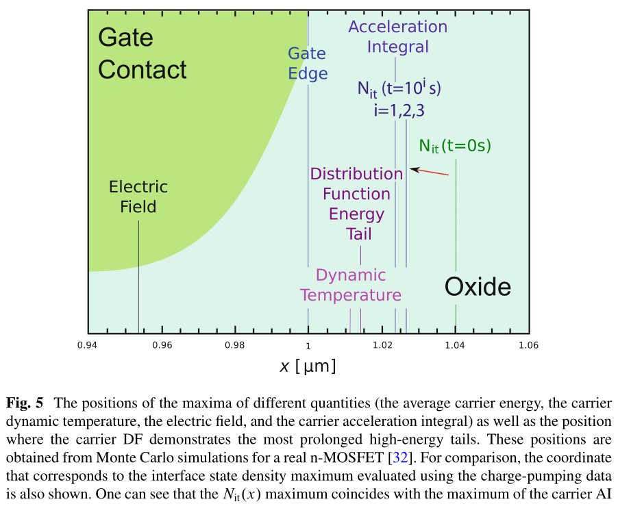
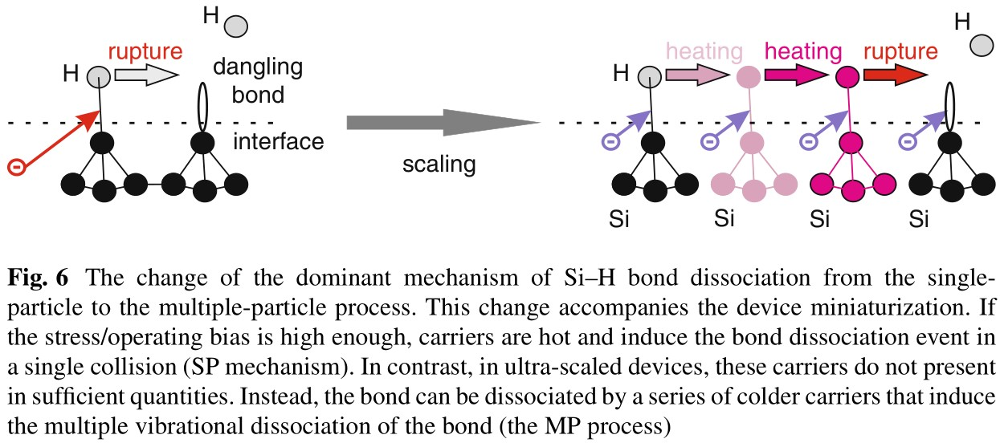
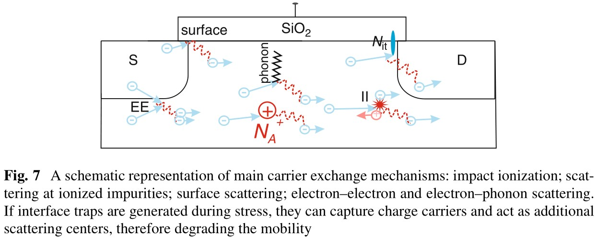

注：该作者写过两篇更早的论文

1. [Physical Modeling of Hot-Carrier Degradation for Short- and Long-channel MOSFETs](https://sci-hub.ru/https://ieeexplore.ieee.org/abstract/document/6861193/)
2. [Modeling of Hot-Carrier Degradation: Physics and Controversial Issues](https://sci-hub.ru/https://ieeexplore.ieee.org/abstract/document/6468962/)

# Physics-Based Modeling of Hot-Carrier Degradation

## 介绍

在MOSFET源漏两端施加电压，载流子在电场加速下可能会获得很高的能量（取决于施加的偏置电压）。当高能载流子与绝缘界面（如介电层）相互作用时，载流子会释放能量，在界面上或界面附近产生损伤。这种有害效应称为“热载流子退化”（hot-carrier degradation, HCD），最早在上世纪70年代早期被报导。

术语中的“热”表明热载流子处于非平衡态，并且具有很高的能量。但这种情况只适用于早期的晶体管（亚微米以上），因为早期的晶体管的工作电压较高，能为载流子提供足够的能量。而随着晶体管尺寸的缩小，工作电压的下降，我们发现冷载流子也会对HCD有一定贡献。

目前普遍认为HCD是因为载流子导致界面处的Si-H键的断裂。在现代CMOS工艺中，刚生长的介电层是无定形态的，而混乱的结构就会导致悬挂键。悬挂键会捕获载流子。为了消除悬挂键的影响，我们注入氢来与之形成Si-H键。当载流子与Si-H键相互作用导致键断裂，就会重新生成悬挂的Si- 键。悬挂键会捕获载流子、形成电荷，进而扰乱器件的电场、使载流子迁移率下降。

研究表明，Si-H键的能量大于1.5eV，但晶体管尺寸的缩小使得工作电压降低到约1V，因此难以产生热载流子。所以我们期望HCD会被抑制，甚至消失。但与预期相反的是，在实验中仍观察到HCD，因此我们扩展了HCD所指代的范围，将冷载流子的贡献也包含在内。

冷载流子主要是通过两种方式破坏Si-H键。一，散射机理会交换载流子能量，使载流子整体的能量分布向高能部分迁移，因此在工作电压低于1V时依然能触发HCD。二，在小尺寸器件中，Si-H键的主要断裂机制是多重振荡激发（multiple vibrational excitation, MVE），即通过一系列冷载流子的碰撞来激发。相比之下，在长沟道器件中，键断裂由单一热载流子的碰撞而产生，称为单一振荡激发（single vibrational excitation, SVE）。在实际工作情况下，MVE与SVE同时存在。

这几种机理在HCD中的占比取决于载流子整体的能量分布。因此，要对HCD建模就必须要基于载流子能量的分布函数（distribution function, DF）。DF可以通过解玻尔兹曼传输方程（Boltzmann transport equation, BTE）得到，但计算过程中需要大量计算机资源，所以在大多数物理HCD模型中，会避免解完整的BTE。比如最成功的HCD模型之一——Bravaix模型，是基于Rauch和La Rosa提出的“能量驱动范式”。根据这种范式，bond-breakage rate 取决于所谓的“knee” energies，并且与 stress/operating condition 有关。从而避免计算DF，并且 bond-breakage rates 通过一些经验性参数来建模。

早期版本的Bravaix模型将散射和键断裂看作独立的过程，其比例与拟合参数有关。但考虑到这两者之间会通过能量分布相互影响，比如，产生的陷阱会捕获电子，从而作为额外的散射中心，并扰乱电势。因此，能量分布被键断裂过程影响。同理，散射过程也能影响DF。所以在同一个模型框架中，能量交换过程和键断裂过程需要自洽。这种自洽的第一个实现是最新版本的Bravaix模型。

我们展示并验证了基于全面 BTE 的解的物理 HCD 模型。该模型整合了正确描述 HCD 所必需的三个组成部分：1. Boltzmann 传输方程求解器，用于 2. 正确处理断键动力学和 3. 退化设备的模拟。为了求解 BTE，我们使用基于蒙特卡洛 (Monte Carlo, MC) 方法的随机求解器和采用载体 DF 的球谐函数展开 (spherical harmonics expansion, SHE) 的确定性求解器。模型的两个版本都将根据在 ultra-scaled 和长沟道器件上测量的实验数据进行验证。

## HCD的主要特性

HCD的主要特性之一是区域性。电子从源到漏过程中被电场加速（见图 3），因此，载流子的群速度增加。在漏极处，热沟道电子与被加热的载流子混合（hot-channel electrons mix with the thermalized carriers of the drain）使得平均能量重新接近与平衡态。因此，最大载流子能量出现在栅末端靠近漏处（见图4）。还要注意，载流子能量是从电场中获得的，电场是载流子加速的原因。

这些特性使得分析变得复杂，并导致两种对立的理解HCD的方式：（1）HCD是由场驱动，相对的（2）HCD是由载流子释放的能量触发的。前者引出了“幸运电子模型”，这是最著名的HCD模型之一，由Hu提出。在该模型范式下，如果一个电子有足够高的能量越过Si/SiO2界面的势垒，且没有能量损失、不被散射回沟道，那么该电子将进入SiO2的导带，并是释放多余的能量，从而产生缺陷。这个幸运电子的能量来自于电场，因此HCD是由场驱动的。

后来，IBM的研究者进行了一系列热载流子压力测试使用不同的注入模式，即 Fowler-Nordheim 和 direct tunneling stresses，还有 substrate hot-carrier 和 channel hot-carrier stress。一系列论文说明了界面态的产生概率取决于载流子释放的最大能量，而不是电场，而且对 concrete stress mechanism 不敏感。这些发现引出了HCD的能量驱动范式。因此，许多早期的经验性或现象性HCD模型将界面态的产生与某些宏观量关联起来，如电场、平均载流子密度、动态温度（图4）。但在最近的研究中发现界面态密度$N_{it}$与这些宏观量无关，并且更适合用载流子加速积分（carrier acceleration integral, AI）描述，这可以表现出载流子整体的对键的积累性破坏作用（见图5）。

为了充分理解HCD，我们需要考虑一个重要问题：为什么在工作电压约为1V的缩小器件中HCD会更加严重？尤其是这些器件中不太可能有热载流子。一个主要的原因就是存在某些能量交换机制使得载流子中热载流子部分增加，这些机制包括碰撞电离、俄歇复合、电子-声子散射、电子-电子散射。另一个主要原因则是一种键断裂的机制：冷载流子可以通过多重振荡激发来破坏键。

我们先考虑在ultra-scaled MOSFET中对Si-H键断裂起主要作用的MVE过程。随着器件尺寸缩小，产生HCD的过程也有所不同。当器件的工作电压较高，载流子的能量大于1.5eV（破坏键所需的能量），单一载流子能够导致键断裂，这种过程称为单粒子机制（single particle, SP）。由于电子的质量与氢离子的质量之间存在巨大的差异，所以电子转移的能量（动量）十分小，无法引起键断裂。但可以将价电子激发到反键态（antibonding, AB），从而引发斥力导致H被释放。

但是，在ultra-scaled MOSFET中，工作电压会降低，故载流子能量小于1eV。因此，载流子中有高能载流子的概率很低，SP的概率很低。故只能通过一系列冷载流子轰击界面。这些载流子会导致键的MVE。当键处于最高的成键态时，只需要很小的一部分能量就能使氢释放。这个过程因此被称为“多粒子”（multiple particle, MP）机制。

在器件层面，当器件尺寸缩小时，键断裂机制的变化会导致最坏情况 HCD 条件的变化。在长通道器件中，这些条件对应于载流子的最大平均能量。在 n-MOSFET 中，衬底电流 Isub 通常用作 HCD 严重程度的标准。

该电流 Isub 由碰撞电离产生的多数载流子组成，通过电场与少数载流子分离并由体电极收集。所采用的碰撞电离和键解离过程具有类似 Keldysh 的反应截面和相同的速率结构。因此，$I_\tx{sub}$ 可用于判断碰撞电离和键解离强度。最坏的情况通常发生在 $V_{gs} = (0.4–0.5)V_{ds}$. 由于相同的原因，在 p-MOSFET 中，HCD 最坏情况条件对应于栅极电流最大值，但 $V_{gs}$ 和 $V_{ds}$ 之间的这种经验相互关系不成立。然而，在ultra-scaled 器件中，最大平均能量在 HCD 最坏情况下并不那么重要。相反，撞击界面的载流子通量起着至关重要的作用。对于 n 沟道和 p 沟道超大规模 MOSFET，最坏情况发生在 $V_{gs} \sim V_{ds}$

至于能量交换机制，在长沟道器件中，它们通常抑制系综的高能部分，从而减弱 HCD. 然而，在 ultra-scaled MOSFET 中，它们可以加强甚至导致 HCD。不同散射机制的共同作用决定了 HCD 的温度特性。与在较高温度下变得更加严重的偏置温度不稳定性的姊妹现象相比，HCD的情况更加复杂。在长通道器件中，如果温度升高，HCD 会被抑制。这可以用散射机制的速率来解释（见图7）。在通过器件时，载流子会经历散射事件，从而交换它们的能量。这导致载流子 DF 的演变（见图 3）。影响 DF 的主要散射机制有五种：碰撞电离；表面散射；在电离杂质处散射；电子-声子和电子-电子散射。

$$
\begin{cases}
\text{SP}
\begin{cases}
    \text{碰撞电离}\\
    \text{俄歇复合}\\
    \text{电子-声子散射}\\
    \text{电子-电子散射}
\end{cases}\\
\text{MP}
\end{cases}
$$

### Hess模型

Hess模型的主要突破在于引入了载流子AI（acceleration integral）。Hess模型通过AI来考虑载流子整体对键断裂的累积性效应。因此，Hess自然地将两种过程考虑在内：由单一高能载流子造成的键断裂（SP）、由多个载流子连续轰击造成的键断裂（MP）。SP和MP的比例取决于AI。

正如前面讨论的，SP主要通过将价电子激发到反键态来使键断裂。对于这种情况，我们可以列出 AI：

$$
R_{SP} \sim \int_{E_{th}}^\infty F(E)P(E)\sigma(E)\;\mathrm{d} E
$$

其中，$F(E)$是载流子流，即每分钟每单位面积内对界面有影响的载流子的数量；$\sigma(E)$ 是键断裂反应的横截面；$P(E)$ 是反应导致H释放的概率。该积分下限为键断裂所需的激活能 $E_{th}$。注意，载流子流 $F(E)$ 是载流子能量分布函数、能态密度和载流子速度的乘积。

MVE这个概念首次提出是在对氕氘从钝化硅界面分解的研究。该研究通过STM尖释放电子来诱发氢分解。这些电子的能量很低，因此分解是通过MP过程引起的。有趣的是，氕的分解率比氘的分解率大三个数量级，因此这个效应叫“巨同位素效应”。

为了描述MVE，我们用简略的谐振模型来描述Si-H键。This oscillator is characterized by the system of eigenstates in the corresponding quantum well. 撞击界面的载流子流可以引起声子吸收和发射，即键激发/反激发过程。键受到载流子的强烈撞击后，键“爬”上了价态，当键在最高价态时，只需要一点能量就能让氢从最高价态释放到游离态。键激发/反激发的概率（或速率？？）是：

$$
P_d \sim \int_{E_{th}}^\infty I(E)\sigma_{ab}(E)[1-f_{ph}(E-\hbar \omega)] \;\mathrm{d}E\\
P_u \sim \int_{E_{th}}^\infty I(E)\sigma_{emi}(E)[1-f_{ph}(E+\hbar \omega)] \;\mathrm{d}E
$$

其中，$I(E)$是轰击键的载流子流；$\sigma_{ab}$ 和 $\sigma_{emi}$ 是声子吸收/释放反应的横截面，并满足Bose-Einstein概率分布；$\hbar \omega$ 是谐振能级的距离。积分从反应的最低能级 $E_{th}$. 因此MP过程的速率（概率）可以写作：

$$
R_{MP} = \left(\frac{E_B}{\hbar \omega}+1\right)\left[P_d+\exp(\frac{-\hbar \omega}{k_BT_L})\right]\left[\frac{P_u+\omega_e}{P_d+\exp(-\hbar \omega/k_BT_L)}\right]^{-E_B/\hbar \omega}
$$

其中，$E_B$是最终的价态能级；$\omega_e$ 是相应的声子寿命，其定义了MVE模式的衰退。

Hess的另一个特点是考虑了所有中间能级的量子阱，而不仅仅是最初和最终的能级。因此键断裂的概率为：

$$
R = \sum_{i=0}^{N_l} \left[ \frac{I_df_v + \omega_e \exp  (-\hbar\omega/k_BT_L)}{I_d f_v + \omega_e} \right]^i A^i I_d f_d
$$

累积性的键断裂率通过经验性参数 $A^i$,$f_d$ 和 $f_v$ 与漏电流 $I_d$ 相关联。累加中的每一项代表每一个能级对键断裂过程的贡献。方括号外的因子代表 $P_u$ 与 $P_d$ 的比例，可以用 $I_d$ 重写为更简单的形式：

$$
\begin{aligned}
    P_u &= I_d f_v + \omega_e\\
    P_d &= I_d f_v + \omega_e \exp (-\hbar \omega/k_B T_L)
\end{aligned}
$$

Hess模型因为提出了很多开创性概念而出名，但它也有很多缺点。首先，界面陷阱是在微观层面上考虑的，没有与器件层面相联。在Hess模型中，器件的寿命定义为缺陷浓度$N_{it}$达到阈值，这会导致对寿命的错误估计，因为HCD是一种强烈不均匀的现象，在相同应力时间下，会在器件的不同区域产生不同的浓度$N_{it}$。

### Energy-Driven Paradigm

energy-driven paradigm 的两个主要贡献是：1）在 ultra-scaled MOSFET 中，EES 起到主导作用。如果不考虑EES，则无法通过SP在ultra-scaled MOSFET中产生热载流子，而EES增强了粒子流的高能部分，故EES是短沟道HCD的主要原因，且决定着HCD温度特性。

2）该方法认为从180-nm结点往下，HCD的驱动因素是由载流子释放的能量，而不是电场。这样就不用计算载流子DF，从而简化计算。这种简化方法是基于碰撞电离和键断裂率具有相似性，两者都能用相似形式的载流子AI方程来描述：$\int f(E)S(E)\,\text{d}E$，其中 $f(E)$ 是载流子能量DF，$S(E)$ 是反应截面。由于DF随能量增大而下降，而反应界面随能量增大而平方增大，两者的乘积存在 1 或 2 个极大值，且两个极大值附近值迅速减小，因此，我们近似认为这两个过程（碰撞电离和键断裂率）由这两个极值控制。这两个极值称为knee energy，且与漏极电压有关。

该方法的缺点同Hess模型，均是没有从器件级去考虑，同时没有考虑HCD的局域性。

### Bravaix Model

平均载流子能量高的应力电压所对应的HCD机制是SP，可以用幸运电子模型描述，器件寿命可以描述为：

$$
1/\tau_\text{SP} \sim (I_d/W)(I_{sub}/I_d)^m
$$

其中，经验参数 $m$ 约为2.7

平均载流子能量低但载流子密度高的则对应于MP，器件寿命可以描述为：

$$
1/\tau_\text{MP} \sim [(qV_{ds}-\hbar \omega)^{1/2}(I_{sub}/W)]^{E_B/\hbar \omega} \exp (-E_\text{emi}/k_B T_L)\approx [V_{ds}^{1/2}(I_d/W)]^{E_B/\hbar \omega}
$$

而平均载流子能量中等、载流子密度中等时，则对应EES，相应寿命为：

$$
1/\tau_\text{EES} \sim (I_d/W)^2(I_\text{sub}/I_d)^m
$$

式中的平方是由“碰撞电离”引入的，虽然碰撞电离只会产生冷载流子，但它们可以通过EES转化为高能粒子，然后通过SP引发键断裂。

总的器件寿命时间为：

$$
1/\tau_d = K_\text{SP}/\tau_\text{SP}+K_\text{EES}/\tau_\text{EES}+K_\text{MP}/\tau_\text{MP}
$$