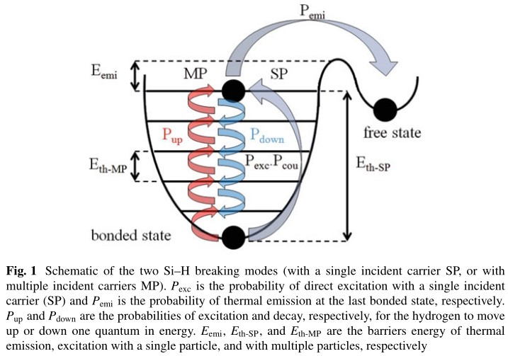
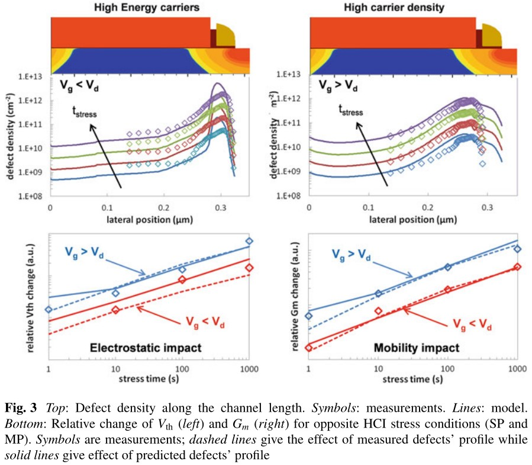
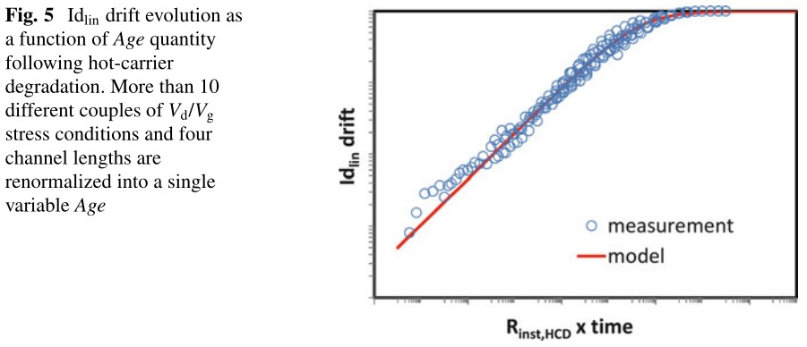
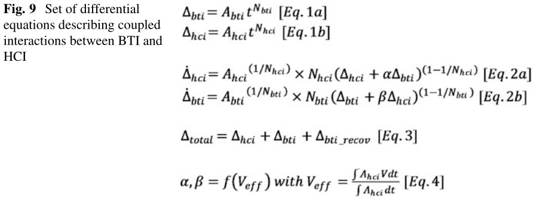
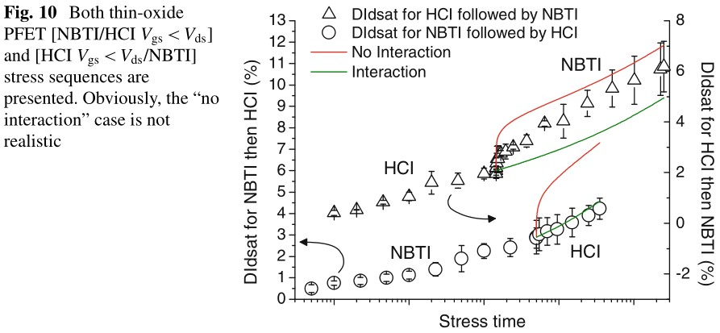
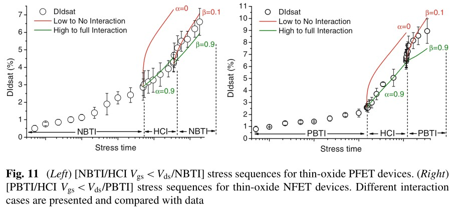

# Hot-Carrier Injection Degradation in Advanced CMOS Nodes: A Bottom-Up Approach to Circuit and System Reliability

标题：在CMOS先进节点中的热载流子注入退化

作者：Vincent Huard, Florian Cacho, Xavier Federspiel, and Pascal Mora

## 1 介绍

在微电子行业中，大多数应用领域的发展都是由工作频率的提高所驱动的。每个产品都可以在各种类型的工作条件下使用，从而迫使每个晶体管上的信号类型多种多样。这使得一个问题日益受到关注，即：如何保证产品在运行多年后的频率与出厂时一样。因此，在晶体管级准确表征可靠性成为必要的要求，这需要考虑各种压力条件，并且需要有实现良好的预测能力。在这种情况下，热载流子注入 (HCI) 退化应力下晶体管的退化不再能够在所谓的最坏情况应力条件下进行研究，而是必须覆盖所用 $V_{gs}/V_{ds}$ 工作条件。对新应力条件的研究证明了新的退化现象 [例如电子-电子散射 (EES) 或多重振动激发 (MVE)]。要充分理解它们，需要在微观尺度上分析退化，以便在晶体管级别甚至更高的层次建模级别提出预测建模。

在本章中，描述了一种自底向上的HCI 退化方法。在第一部分，将简要描述缺陷产生导致晶体管参数退化背后的微观机制。在第二部分，我们将描述晶体管紧凑建模方法，强调缺陷生成率和参数相关性。HCI 和偏置温度不稳定性 (BTI) 模式之间的相互作用需要足够的建模以允许在现实应力下进行预测建模。在第三部分中，将在数字和模拟条件下讨论模型到硬件的相关性 (MHC)，以强调对鲁棒可靠性紧凑模型的需求。在最后一部分中，我们将展示如何使用模型来准确量化设计流程中要采用的裕度或实现设计强化。

## 2 HCI 微观退化建模：从单载流子到多载流子退化过程

HCI 过程中有多种退化机制。在高 $V_{ds}/V_{gs}$ 比例下，载流子通过横向电场加速获得足够能量来触发单个高能粒子（single particle, SP）退化过程。在这种模式下，单个粒子获得足够的能量以在一次相互作用中破坏键。与这种模式相对的是，在高 $V_{gs}/V_{ds}$ 比例下，载流子密度变得足够高以触发与低能粒子降解过程的多重相互作用（multiple particles，MP）。

### 2.1 SP 和 MP 退化过程

首先在原子尺度上研究了 SP 和 MP 退化过程的 Si-H 键断裂。研究已经表明，SP 退化过程是由成键/反键状态转变与弯曲模式之间的非谐耦合引起的，具有势垒能量 $E_{B,b}=1.5\text{eV}$。然后将其应用于宏观尺度以对 MOSFET 参数（$Id_\text{lin},G_m$等）的退化进行建模。[11] 首次尝试使其适应微观尺度，给定的应力条件具有高 $V_d/V_g$ 比，以便预测在 HC 应力期间沿通道产生的缺陷分布。这种方法用于解释在大范围的 $V_{ds}/V_{gs}$ 比中 HC 诱导的退化，涵盖极端（SP 和 MP）和介于两者之间的压力条件。在这种情况下，SP 退化过程中入射载流子的 H 解离率表示如下：

- $S_{SP}(E)=0$ for $E<1.5\text{eV}$
- $S_{SP}(E)=\text{常数}$ for $1.5\text{eV}<E<1.9\text{eV}$
- $S_{SP}(E)=a\cdot \exp(3.E)$ for $1.9\text{eV}<E<2.5\text{eV}$
- $S_{SP}(E)=(E-1.5)$ for $2.5\text{eV}\leq E$

第四个部分，在高能量下，直接符合原子和宏观测量，在较低能量下，$S_{SP}$ 方程偏离其理论表达式 $(E-1.5)^p$，如故障时间 (TTF) 测量[12,13]中所见。这种偏差可以通过 MP 事件对较低能量的贡献增加来解释，这是混合模式退化机制的开始，将在下一部分详述。因此，这个 $S_{SP}(E)$ 表达式不能按原样使用，需要对 MP 事件进行反卷积。

[7] 测量了由 MP 过程引起的 Si-H 键断裂；后续 [2] 表明，对于 HC 应力条件，MP 退化过程导致弯曲模式共振的直接激发，具有振动模式能量 $\hbar \omega_b = 0.075 \text{eV}$。在这种情况下，MP 退化过程中入射载流子的 H 解离率表示为：

$$
S_{MP}(E)=(E-0.075)^{0.5} \quad \text{for} \ E\geq 0.075\text{eV}
$$

然而，如果我们只考虑 SP 和 MP 降解过程，则无法在任何给定的 HC 应力条件下解释向通道中间延伸的降解，因此表明需要在 SP 和 MP 之间使用混合退化模式（mixed degradation mode, MM）在 HCI 条件下，将缺陷的产生处理并统一为一种通用形式。

### 2.2 MM 退化过程

MM 的物理解释可以在测量 [16] 中找到，表明拉伸模式（$E_{B,s}=2.5\text{eV}$，$\hbar \omega_s=0.25\text{eV}$）和弯曲模式之间可能发生非谐耦合。直接激发拉伸模式可以为其提供一个能量量子，而该能量可以通过为弯曲模式提供三个能量量子和一个横向声学声子来损失。

代表弯曲模式能量的势阱（图片 2）分为20个能级（$E_{B,b}/\hbar \omega_b$）。SP 和 MP 退化过程分别涉及一个载流子为键提供 20 个能量量子，以及 20 个载流子提供一个能量量子。MM 则涉及多个载流子的任意组合，每个载流子为键提供任意数量的能量量子，以达到最后的成键态。这种形式主义解释了键的非谐性和泛音的非零跃迁概率，与 Morse 势进行比较，保持能级的均匀分布。

最后，从理论上和实验上评估了 Si-H 键断裂的速率方程为

$$
S_{it,m}=a_m\cdot (E-\cdot \hbar \omega_b)^{m\cdot 0.5}
$$

$$
a_m = 7.18 \cdot 10^6 \exp (-0.78\cdot m)
$$

$$
R_{inst} = \iint_{m,E} f(E)\cdot g(E) \cdot v(E)\cdot S_{it,m} (E) \cdot E
$$

其中，$f(E)$ 是载流子分布函数，$g(E)$ 是能态密度，$v(E)$是载流子速度，$S_{it,m}(E)$ 是具有能量 $E$ 的载流子将 $m$ 能量量子给弯曲模式的 Si-H 键的概率。

### 2.3 缺陷产生与 MOS 参数退化

该理论模型在广泛的 HCI 应力条件下得到验证，为此提取了沿沟道长度的缺陷分布，使用带电荷泵的横向分析，结合漏极电流测量的横向分析。图 3（顶部）显示了在 $V_{gs} < V_{ds}$ 和 $V_{gs} > V_{ds}$ 应力条件下缺陷产生的测量和模拟之间的比较，证实了良好的一致性。在 Sdevice [19] 中引入了预测的缺陷密度横向分布，以重现它们对静电退化 ($V_{th}/V_{th0}$) 和迁移率（$\Delta G_m/G_{m0}$）的影响。图 3（底部）显示了 $V_{th}$ 和 $G_m$ 相对变化的测量值与模型测量和预测的缺陷横向轮廓影响的模拟之间的比较。最后，沿沟道的缺陷定位也对 MOS 参数相关性产生强烈影响（图 4）。如果缺陷强烈地集中在 LDD 区域，则静电是漏电流劣化的弱组成部分，反之亦然。MOS 参数退化与各种 HCI 应力条件的相关图突出了了解通道中的缺陷定位对于晶体管性能退化的准确建模的重要性。

## 3 HCI：电路可靠性模拟

为了使电路设计人员能够确定长期退化对其电路性能的影响，可靠性仿真不可或缺。在这个模拟中，他们应该能够正确地确定电路中每个单独器件正在经历的退化量。根据退化量，他们应该能够调整器件的参数，从而使性能下降反映在器件行为中，从而反映在电路性能中。

### 3.1 电路可靠性模拟

据作者所知，第一篇关于使用模拟的器件退化和电路灵敏度之间关系的论文发表于 1987 年。然而，在 1980 年代中后期，加州大学伯克利分校首次尝试通过瞬态器件退化计算自动模拟实际电路退化行为。它最终得到了 BERT 可靠性模拟器。BERT 中包含的方法成为电路级可靠性仿真的事实上的标准。根据这些概念，几乎所有 EDA 供应商和许多半导体公司都开发了仿真工具来评估芯片的可靠性。

今天的大多数 EDA 工具都得到了增强，使用户能够通过供应商定义的应用程序编程接口 (API) 插入他们自己的可靠性模型。可靠性模拟流程一般包括两个阶段：分别是预应力模拟阶段和后应力模拟阶段。根据需要，这两个仿真阶段可以在同一次仿真器运行中执行，也可以独立执行。

与晶体管退化效应的电路级模拟有关的一个最显着的困难在于，随着时间的推移，器件退化的速度非常慢。晶体管特性出现可测量的退化量所需的时间段通常比电路的操作周期长几个数量级。因此，需要一段不切实际的模拟时间来考虑电路内 MOS 晶体管的动态老化。

在预应力仿真期间，仿真器根据退化模型独立计算电路中所有 MOSFET 的电应力，作为其自身刺激的函数。为了完成这项任务，模拟的交流退化水平必须与预定的设备参数退化水平相关联，而设备参数退化水平通常是在直流应力条件下测量的。为此，引入了一个名为 $Age$ 的新变量。该参数提供了比较在电路中运行的设备所经历的退化水平与直流应力设备的退化水平的方法。

$$
Age(T) = \int_{t=0}^{t=T} \sum R_{inst,i}(t)\cdot \dif t
$$

其中，$R_{inst,i}$ 是退化模式 $i$（NBTI、HCI等）在模拟时间 $t$ 的瞬时损坏率，正如方程（3）所描述的，这取决于来自预应力模拟的电刺激。该瞬时速率在 $T$（预应力模拟的总长度）上进行积分。Age 的这种形式可以使 $V_d/V_g/V_b$ 维度中的任何应力归一化，如图 5 所示。

计算取决于每个目标设备的电气仿真条件。在瞬态分析的整个持续时间内，退化模型中的单个 Age 值在用户指定的模拟时间间隔内进行积分。然后将结果外推到用户指定的电路运行时间的计算总应力。

在后应力仿真期间，器件特性的退化因此转化为电路级的性能退化。根据 MOSFET 老化模型，电应力总量随后被转换为器件性能退化。为了表示退化的器件，需要与 MOS 退化后的 I-V 曲线相匹配的 SPICE 模型描述。最初，在 BERT 等模拟器中，采用的方法是在不同应力条件下提取完整的模型参数集。然后从所有模型集形成查找表。例如，在实际操作条件下，如果净退化被评估为 5%，那么相应的 SPICE 模型将从器件模型的查找表中选取。然而，在这种情况下，存在一个缺点，因为在启用可靠性仿真时需要存储大量 SPICE 模型。克服这个缺点的方法是：识别受设备退化影响的某些模型参数 $P_i$ 并利用某个函数 $F$ 将它们的变化描述为 $Age$ 的函数，在最简单的情况下，它可以是幂律函数：

$$
\Delta P_i = F(Age) \approx A_i \cdot (Age)^{n_i}
$$

需要更新的 SPICE 参数子集取决于压力和器件系列。然后由 SPICE 仿真器执行全局参数（例如每个退化晶体管的漏极电流）的更改，从而无需存储大量 SPICE 模型集。Aur 等人[27]引入了这一概念，现已成为所有 EDA 工具中的标准方法。

然后提取 SPICE 参数的子集，以允许再现各种应力条件和几何形状的晶体管的参数的实验漂移（图 6）。

应特别注意正确电气参数漂移相关性的建模。如图 7 所示，对于给定的饱和漏电流 $I_\text{on}$ 退化，由于漏区附近的缺陷定位，HCI 期间线性漏电流 $I_\text{dlin}$ 降低比 NBTI 退化高 40%，如前一节通过 TCAD 模拟所讨论的。

最后，应该通过比较晶体管在各种退化条件下的实验和模拟 I-V 特性来验证 SPICE 参数的子集（图 8）。

### 3.2 BTI 和 HCI 的耦合

热载流子退化发生在整个 $V_{ds}/V_{gs}$ 范围内，并由可靠性紧凑模型描述，如前一节所述。与之对应的是，BTI 仅在具有零 $V_{ds}$ 的垂直电场下存在，且表现出永久部分和可恢复部分，如先前提出的最先进模型中 [3,28] 所建模。据作者所知，所有已发布的可靠性紧凑模型都假设 BTI 和 HCI 退化是相加的。然而，最近通过实验证明了这两种模式之间的相互作用 [29, 30]。对于 HCI 和 BTI，退化 $\Delta$ 通常用归一化函数表示，如图 9 中的方程 (1a) 和 (1b) 所示。

然而，在这两种机制中产生的缺陷是相同的（界面态$N_{it}$），只是它们各自的位置不同。正如之前报道的 [29, 30]（参见图 10），BTI 和 HCI 之间沿着相同缺陷产生位点的竞争会导致自限反应。图 9 中的方程 (2a) 和 (2b) 突出显示了一组耦合的常微分方程中 HCI 和 BTI 降解机制的相互作用。通过耦合因子 $\alpha$ 来描述，HCI 退化 $\Delta \text{hci}$ 受 BTI 退化的影响。而对应的相互作用则可以用 $\Delta \text{bti}$ 来描述，耦合因子为 $\beta$。最后，为了获得总退化，将描述可恢复 BTI 部分的附加项添加到两个耦合方程 [图 9 中的方程 (3)]。耦合因子来自于由 BTI（优先分布在沟道中）和 HCI（位于漏附近）引起的 $N_{it}$ 位置的重叠。这些因素是应力的函数，如图 9 中的等式 (4) 所示。

最近的实验结果清楚地说明了对耦合因子测量的需求。图 11（左）显示了在 NBTI 应力之后的 PMOS $Id_{sat}$ 漂移，然后是 HCI 应力和 NBTI 应力。取 $\alpha=0.9$ 和 $\beta0.1$ 时的相互作用与测量结果非常吻合。值得注意的是，HCI 应力不受先前 NBTI 应力的影响($\alpha=0$)，导致将退化高估了2倍。在 HCI 应力后的 NBTI 期间，没有交互模型的误差较小。事实上，在 NBTI 期间，$N_{it}$ 的积累会受到 HCI 压力期间产生的预先存在的 $N_{it}$ 的轻微影响。一种解释可能是两个 $N_{it}$ 横向轮廓纵横比的差异。对于具有相同顺序的 NMOS，有相同的结论，如图 11（右）所示。

需要一个考虑 HCI 和 BTI 之间相互作用的可靠性紧凑模型，以便在电路级进行准确和预测的可靠性仿真。一旦计算了所有竞争模式及其各自的耦合，就必须始终如一地使用器件级退化来进行电路级的老化评估。

### 3.3 电路级模型到硬件的相关性

讨论到这里，我们的设备级模型已使用准静态实验结果在单个器件上进行了验证。因此，在更接近实际产品设备使用的环境中检查这些可靠性模型的硅验证非常重要

#### 3.3.1 数字标准单元使用

为了验证数字电路中的可靠性漂移，已在包含基于标准单元的关键路径的测试芯片载具上进行了高温 (HTOL) 和低温工作寿命测试 (LTOL)，此处用作测试案例。

